# Afsordeh & Shirali (2025) — 论文全文精讲

> 生成日期：2026-03-08
> 预计阅读时间：60 分钟
> 图表数量：6 张图 + 8 张表

## 论文信息

- **标题**: Machine Learning-assisted Prediction of Polymer Glass Transition Temperature: A Structural Feature Approach
- **作者**: Bardia Afsordeh, Hadi Shirali
- **期刊**: Chinese Journal of Polymer Science, 2025, 43, 1661–1670
- **DOI**: 10.1007/s10118-025-3361-3
- **页数**: 10 页
- **单位**: Amirkabir University of Technology, Tehran, Iran

## 全文结构概览

```
1. Introduction (pp. 1-2)           — 背景 + 文献综述 + 研究目标
2. Methods (pp. 2-4)
   2.1 Machine Learning Models      — RF, ET, GPR, GB 四种算法
   2.2 Feature Representation       — 数据集 + 邻接矩阵
   2.3 Flexibility                  — 柔性描述符
   2.4 Side Chain Occupancy Length  — 侧链占据长度
   2.5 Hydrogen Bond                — 氢键强度
   2.6 Polarity                     — 极性
   2.7 Modeling                     — 数据划分 + 评估指标
3. Results and Discussion (pp. 4-8)
   3.1 ML Algorithms Results        — 四模型性能对比
   3.2 Features Importance          — 特征重要性排序 + 消融实验
   3.3 Investigation of Largest Deviations — 最大偏差分析
4. Conclusions (p. 8)               — 总结
References (pp. 8-10)               — 83 条参考文献
```

---

## 1. Introduction (pp. 1-2)

### 第 1 段：聚合物与 Tg 的重要性

> **[原文]** "Polymers are among the most valuable materials used regularly in engineering and daily life, making it essential to understand their properties and the factors that affect them. One of the most important and useful properties of polymers that affects their physical and mechanical behavior is the glass transition temperature (Tg). This temperature defines the behavior of polymers across different temperature ranges."

**[解说]** 论文开篇直入主题：聚合物在工程和日常生活中无处不在，而 Tg 是决定聚合物行为的"分水岭温度"。在 Tg 以下，聚合物呈现硬而脆的玻璃态；在 Tg 以上，链段可以运动，材料变得柔软。这意味着一个聚合物适合做什么用途（轮胎、水管、食品包装等），很大程度上取决于它的 Tg 和使用温度的关系。

**[白话翻译]** 聚合物很重要，而 Tg 是它们最关键的温度——高于它就变软，低于它就变硬。

**[与前文的联系]** 这是全文的起点，建立研究动机。

> **[背景补充]** 玻璃化转变温度（Tg）不是相变（不像冰变水那样突然），而是一个**渐变过程**——链段运动逐渐"解冻"。不同测量方法（DSC、DMA）会给出略有不同的 Tg 值，这也是后文讨论测量误差的伏笔。

---

### 第 2 段：Tg 的测量方法及其局限

> **[原文]** "Numerous approaches for calculating Tg have been reported in the literature, both experimentally and through various simulation methods. The most common experimental techniques include Differential Scanning Calorimetry (DSC) and Dynamic Mechanical Thermal Analysis (DMTA). Although these methods are highly effective for analyzing the thermal properties of materials, they are less efficient when speed is a priority."

**[解说]** 作者指出传统实验方法（DSC 和 DMTA）的痛点：**慢**。每合成一个新聚合物，就得重新做实验测 Tg。对于高通量材料筛选场景（比如从 1000 个候选结构中选最优），一个个做实验是不现实的。这就是 ML 方法的市场切入点。

**[白话翻译]** 传统测 Tg 的方法虽然准，但太慢了——每个新聚合物都得重新做实验。

**[与前文的联系]** 承接第 1 段"Tg 很重要"，这里指出传统获取 Tg 的方法存在效率问题，为引入 ML 做铺垫。

---

### 第 3 段：影响 Tg 的三大结构因素

> **[原文]** "Because Tg is closely related to the dynamics of polymer chains, anything that affects chain movement will influence Tg. Factors such as hydrogen bonds tend to increase Tg by slowing the motion of the chains. These factors can be categorized into three main groups: the flexibility of polymer chains, the free volume between chains, and the strength of interactions between chains."

**[解说]** 这段是全文最核心的物理洞察之一。作者把影响 Tg 的因素归纳为三类：(1) **链柔性**——链越刚越难动，Tg 越高；(2) **自由体积**——链间空间越小，越拥挤越难动；(3) **链间相互作用**——氢键、极性等越强，链被"拴住"越紧。后面设计的 4 个描述符正好一一对应这三类因素：Flexibility 对应 (1)，SOL 对应 (2)，H-bond Power 和 Polarity 对应 (3)。

**[白话翻译]** 影响 Tg 就三件事：链本身硬不硬、链之间挤不挤、链之间粘不粘。

**[与前文的联系]** 从"Tg 是什么"过渡到"Tg 由什么决定"——这是后续特征工程的物理基础。

> **[具体例子]** 举个直觉例子：聚苯乙烯（PS）有苯环（刚性结构），Tg ≈ 373 K（高）。聚二甲基硅氧烷（PDMS）主链全是柔性的 Si-O 键，Tg ≈ 150 K（低）。差了 200 多度，核心原因就是链柔性差异。

---

### 第 4 段：从模拟到机器学习

> **[原文]** "With the increasing computational power available today, simulations have become faster and more accessible, offering rough estimates of Tg. A more recent solution... Machine learning (ML) is particularly promising, as it enables machines to predict specific properties based on input data."

**[解说]** 作者梳理了方法演进路线：实验（准但慢）→ 模拟（快一些但不够准）→ ML（又快又准，但需要好数据和好特征）。这条路线和材料科学的大趋势完全一致——从"做实验"到"算实验"再到"学实验"。

**[白话翻译]** 计算机越来越快，所以人们先用模拟替代实验，现在又用 ML 替代模拟。

**[与前文的联系]** 承接上段"传统方法慢"的问题，给出解决路径：ML。

---

### 第 5 段：文献综述——已有 ML 方法及其不足

> **[原文]** "Huang et al. utilized graph convolutional neural networks (GCNN) to predict the Tg of copolymers, using the SMILES notation as input. They reported a root mean square error (RMSE) of approximately 35.76 K. Zhang et al. used quantum chemistry-based descriptors... achieving a mean absolute error (MAE) of 2.5578 K, but their database was relatively small, consisting of only 48 entries."

**[解说]** 这段是关键的文献综述，作者系统梳理了 6 项先前研究，并指出每项研究的**不足**：

| 先前研究 | 方法 | 问题 |
|---------|------|------|
| Huang et al. | GCNN + SMILES | RMSE 35.76 K（精度不够） |
| Zhang et al. | 量化描述符 + GPR | 数据集仅 48 条（太小） |
| Pugar et al. | QSPR + RF | 数据集仅 43 条 |
| Wen et al. | 模拟 vs ML | ML 相关系数仅 0.8 |
| Chen et al. | LSTM + SMILES | 测试集 R² = 0.84 |
| Armeli et al. | 官能团计数 | 用了实验数据 Tm 作为输入 |

这些问题归结为三类：(1) 数据集太小或太单一 (2) SMILES 特征与 Tg 的物理联系不直观 (3) 依赖实验输入（如 Tm）。本文正是要解决这些问题。

**[白话翻译]** 前人也用 ML 预测 Tg，但要么数据太少，要么特征不好，要么需要实验数据当输入。

**[与前文的联系]** 文献综述的目的是找"gap"——前人方法的共同不足，为本文的创新点做论证。

> **[背景补充]** SMILES（简化分子线性输入规范）是一种用文本字符串表示分子结构的方法，比如乙醇是 `CCO`。它的优点是简洁，但缺点是它是语法层面的表示，不直接编码物理性质（如柔性、氢键）。这就是为什么用 SMILES 做输入时"提取的特征可能与 Tg 没有明显联系"。

---

### 第 6 段：本研究的目标

> **[原文]** "In this study, four descriptors were extracted to represent the key factors influencing the Tg of the polymers... The primary goal of this study was to extract these important features based solely on the repeating unit of the polymer, eliminating the need for experimental data as input for the models."

**[解说]** 明确宣言：本文的创新点是用 **4 个结构描述符**（柔性、侧链占据长度、氢键强度、极性）代替 SMILES 或实验数据作为 ML 输入。这 4 个描述符全部可以从聚合物重复单元的结构中计算得到，**不需要任何实验数据**。这是对 Armeli et al. 等使用 Tm 作为输入的直接回应。

**[白话翻译]** 我们的方法只需要画出聚合物的结构式，就能预测 Tg，不用做任何实验。

**[与前文的联系]** 呼应文献综述中指出的三大问题，宣告本研究的解决方案。

---

> **[本节小结]** Introduction 的论证逻辑是一条清晰的"问题链"：Tg 重要 → 传统测量慢 → ML 可以快速预测 → 但前人 ML 方法有缺陷（数据少/特征差/需实验输入）→ 本文用 4 个纯结构描述符解决这些问题。
>
> 核心信息：(1) Tg 的物理本质是链段运动 (2) 影响 Tg 的三因素：柔性、自由体积、链间作用力 (3) 4 个描述符正好对应这三因素

---

## 2. Methods (pp. 2-4)

### 2.1 Machine Learning Models

#### 第 1 段：方法概述

> **[原文]** "ML models can be categorized into three main groups: supervised, unsupervised, and reinforcement learning. In this study, all algorithms used were from the supervised learning category, and the final label, Tg, was known."

**[解说]** 简单交代了本研究使用监督学习。因为我们有明确的输入（4 个描述符）和输出（Tg 数值），这是典型的回归任务。

**[白话翻译]** 我们有答案（实验 Tg），用监督学习让模型从结构特征里学规律。

**[与前文的联系]** 从 Introduction 的问题定义进入方法论，开始详述技术方案。

---

#### 第 2 段：Random Forest (RF)

> **[原文]** "Random forest (RF) is an ensemble learning algorithm that combines the predictions of multiple models to calculate the final result. The base algorithm used by the RF to make predictions is a regression tree (Fig. 1)."

**[解说]** RF 的核心思想是"三个臭皮匠赛过诸葛亮"：单棵回归树容易过拟合，但如果训练 100~200 棵树，每棵树用不同的数据子集和特征子集，最后取平均，就能大幅提高泛化能力。这就是 **Bagging（自助聚合）** 的思想。

**[白话翻译]** 随机森林 = 训练一堆决策树，然后投票/取平均得出结果。

**[与前文的联系]** 第一个介绍的算法，也是最基础的集成方法。

> **[背景补充]** 回归树是一种把数据按条件不断二分的模型。比如"如果柔性 > 0.5 → 左分支，否则右分支"，每个叶子节点给出一个预测值。单棵树很容易过拟合，但森林（多棵树）就很稳健。

---

### Figure 1: Graphical Representation of one regression tree

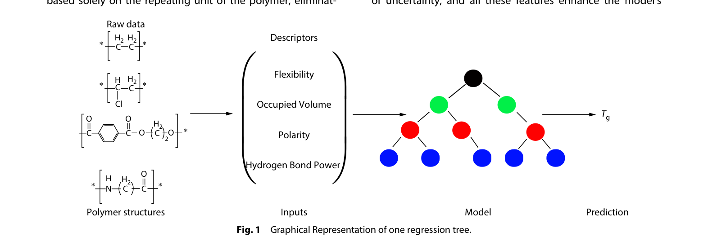

**[图表解读]** 这张图展示了本研究的整体流程：从聚合物原始结构出发，提取 4 个描述符（Flexibility、Occupied Volume、Polarity、Hydrogen Bond Power），输入到 ML 模型中，输出预测 Tg。图中给出了 4 个示例聚合物的化学结构（聚乙烯、聚氯乙烯、聚碳酸酯、聚酰胺）。

**[关键数据]** 无数值数据，这是一张流程示意图。

**[设计意图]** 作者用这张图一目了然地展示"从结构到预测"的完整管线。读者看这一张图就能理解整个方法的思路。

---

#### 第 3 段：Extra Trees (ET)

> **[原文]** "Extra trees (ET) algorithm operates on the same principles as RF... but with a key difference: ET introduces more randomness in the construction of regression trees. Specifically, ET randomizes the selection of features and cut-points for splitting nodes."

**[解说]** ET 是 RF 的"加强随机版"。RF 在每个分裂节点会搜索最优切分点，而 ET 直接**随机选择切分点**。这看起来更粗糙，但实际上有两个好处：(1) 进一步降低方差（更不容易过拟合）(2) 训练更快（不用搜索最优切分）。ET 对噪声数据特别鲁棒，这一点在实验 Tg 数据中很重要——因为不同实验方法测出的 Tg 本身就有误差。

**[白话翻译]** Extra Trees 比随机森林更"随机"——连分裂点都是随机选的，反而因此更抗噪声。

**[与前文的联系]** 与 RF 做对比，突出 ET 的"额外随机性"优势。

---

#### 第 4 段：Gaussian Process Regression (GPR)

> **[原文]** "Gaussian process regression (GRP) is a probabilistic model designed for regression tasks. This is a non-parametric method based on the assumption that the function to be learned is drawn from a Gaussian process."

**[解说]** GPR 和树模型完全不同——它是概率模型，不仅给出预测值，还给出**不确定性估计**（置信区间）。这在材料科学中很有价值：你不仅知道"预测 Tg = 350 K"，还知道"我有 95% 信心 Tg 在 340-360 K 之间"。但 GPR 的缺点是对大数据集计算量大（O(n³)），且容易过拟合复杂数据。

**[白话翻译]** GPR 不只告诉你答案，还告诉你"我有多确定"——这在实验数据有噪声时很有用。

**[与前文的联系]** 第三个模型，与前两个树模型形成方法论互补。

> **[背景补充]** 高斯过程可以理解为"无限维的正态分布"。它假设任何有限个输入点对应的输出值服从多元正态分布。核函数（如 RBF）控制"相似输入是否给出相似输出"。GPR 是贝叶斯方法的典型代表。

---

#### 第 5 段：Gradient Boosting (GB)

> **[原文]** "Gradient boosting (GB)... is a type of supervised machine learning algorithm that employs ensemble learning. It consists of a sequential series of models, with each model aimed at correcting the errors made by the previous model."

**[解说]** GB 与 RF/ET 的关键区别：RF/ET 是**并行**训练（多棵树独立），GB 是**串行**训练（后一棵树专门修正前一棵树的残差）。GB 的优势是能逐步逼近复杂的非线性关系，但缺点是容易过拟合（因为每一步都在拟合残差，可能把噪声也拟合进去）。

**[白话翻译]** 梯度提升 = 每棵新树都专门去"补救"前面所有树犯的错误，逐步变准。

**[与前文的联系]** 第四个也是最后一个模型，四种算法介绍完毕。

> **[具体例子]** 假设第 1 棵树预测聚苯乙烯的 Tg = 350 K（实际 373 K），残差 = +23 K。那么第 2 棵树的目标就是学会预测这个 +23 K 的残差。如果第 2 棵树预测残差 = +20 K，最终预测变成 350+20 = 370 K，更接近真值了。

---

### 2.2 Feature Representation

#### 第 1 段：数据集概述

> **[原文]** "Our dataset consists of 112 polymers and their corresponding Tg values, comprising aliphatic, aromatic, polar, and non-polar types, such as polyolefins, polyethers, polyamides, polyesters, and polyimide. Their glass transition temperatures (Tg) ranged from 124 K to 601 K, all of which were obtained from the referenced handbook."

**[解说]** 数据集的关键参数：**112 条**数据，Tg 范围 124-601 K（从极低的聚二甲基硅氧烷到极高的聚酰亚胺），涵盖 5 大类聚合物。数据来源是 Mark 的 Polymer Data Handbook——这是聚合物物理领域的"圣经级"参考书。数据集虽然不大（112 条），但覆盖面广，且数据质量有保障。

**[白话翻译]** 我们用了 112 种不同聚合物的 Tg 数据，从 124 K 到 601 K 都有覆盖。

**[与前文的联系]** 从模型介绍过渡到数据，"巧妇难为无米之炊"——好的特征需要好的数据。

---

#### 第 2 段：邻接矩阵表示

> **[原文]** "The structure of the repeating units was represented using adjacency matrices (Fig. 2), drawing inspiration from molecular graph theory. In these matrices, the atomic number of atom i is placed in the cell at positions i and i, whereas the number of bonds between atoms i and j is recorded in the cell at positions i, j."

**[解说]** 这是本文特征工程的基础。邻接矩阵是图论中表示图结构的标准方法：矩阵的对角线放原子序数（标识原子类型），非对角线放键数（1=单键，2=双键，3=三键）。这样一个矩阵就完整编码了分子的拓扑信息。后续的 4 个描述符都是从这个矩阵中"读"出来的。

**[白话翻译]** 把聚合物的重复单元画成一个矩阵：对角线写原子是什么，其他位置写原子之间有没有键。

**[与前文的联系]** 解释了输入数据的数学表示方式——如何把化学结构变成计算机能读的数字。

---

### Figure 2: Representation of polychlorotrifluoroethylene

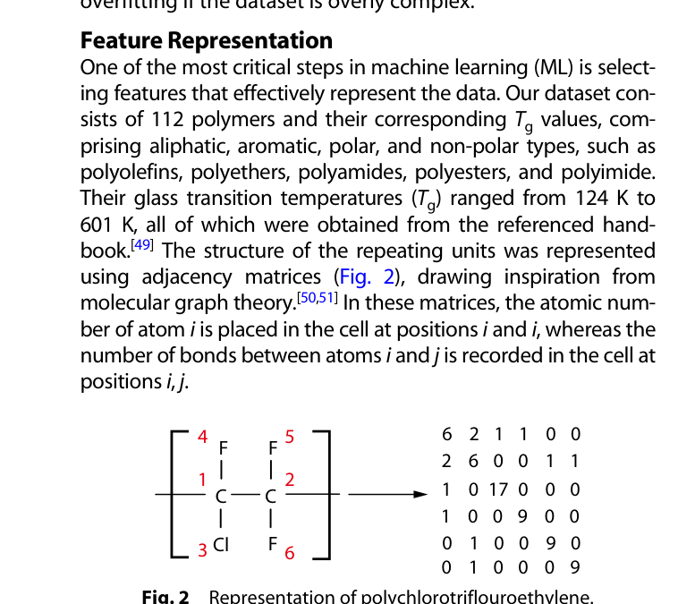

**[图表解读]** 以聚三氟氯乙烯（PCTFE）为例展示邻接矩阵的构造。左侧是分子结构图（标注了 6 个原子的编号），右侧是 6×6 矩阵。对角线上：碳原子 = 6（原子序数），氯 = 17，氟 = 9。非对角线：有单键的位置填 1。例如 C1-C2 之间有单键，矩阵(1,2)和(2,1)位置填 1。

**[关键数据]** PCTFE 的重复单元有 6 个原子（2 个 C + 1 个 Cl + 3 个 F），邻接矩阵是 6×6。

**[设计意图]** 用最简单的例子让读者理解邻接矩阵——从分子结构到数字矩阵的转换过程。

> **[具体例子]** 矩阵中 (1,1) = 6 表示第 1 个原子是碳（原子序数 6）；(3,1) = 1 表示第 3 个原子（Cl）和第 1 个原子（C）之间有一个单键。如果两个原子之间没有直接的化学键，对应位置就是 0。

---

### 2.3 Flexibility（柔性描述符）

#### 第 1 段：柔性的传统计算方法

> **[原文]** "The calculation and definition of flexibility in polymer science have long been a significant topic of interest. Traditionally, modeling flexibility involves estimating flexibility through methods such as Monte Carlo simulations or molecular dynamic simulations. However, these methods are typically slow and inaccurate."

**[解说]** 传统计算柔性需要 Monte Carlo 或分子动力学模拟——计算量大、耗时长。但对 ML 来说，关键洞察是：**不需要绝对准确的柔性值，只需要相对值**。只要能区分"哪个聚合物更柔"就够了。这个洞察让作者得以用一个极简公式替代复杂模拟。

**[白话翻译]** 传统算柔性要跑模拟（很慢），但 ML 只需要"谁比谁更柔"的排序就行，所以可以用简单方法。

**[与前文的联系]** 开始详述 4 个描述符中最重要的第 1 个——柔性。

---

#### 第 2 段：柔性的计算公式

> **[原文]** "The developed algorithm is based on the flexibility and rotation of main chain bonds. First, the rotatable bonds in the main chain were identified... Each type is assigned a value that reflects its contribution to the flexibility. We normalized the result by the number of atoms in the repeating unit."

**[解说]** Flexibility 的计算公式 (Eq. 1) 的核心逻辑：

$$\text{Flexibility} = \frac{f_1 \sum b_{n,i} + f_2 \sum b_{f,j} - f_3 \sum S_k}{N}$$

翻译成白话：**（普通可旋转键的贡献 + 醚键的贡献 − 刚性结构的惩罚）÷ 原子总数**。三个关键设计：(1) 醚键（C-O-C）比普通 C-C 键更柔，给更高权重 (2) 刚性结构（如苯环）做减法 (3) 除以原子总数做归一化，消除分子大小的影响。

**[白话翻译]** 柔性 = （能转的键 − 不能转的结构）÷ 原子总数。越大越柔软，Tg 越低。

**[与前文的联系]** 具体给出了如何从邻接矩阵中提取柔性特征的算法。

> **[具体例子]** 以聚乙烯 (-CH₂-CH₂-) 为例：主链有 2 个 C-C 键都可旋转，无刚性结构，6 个原子（含 H）。Flexibility = (f₁ × 2 + 0 − 0) / 6 = 正值且较大 → 高柔性 → 低 Tg（实验值 ~195 K）。相比之下，聚对苯二甲酸乙二醇酯（PET）有苯环（刚性结构），柔性值大幅降低 → 高 Tg（~345 K）。

---

### 2.4 Side Chain Occupancy Length（侧链占据长度）

> **[原文]** "The free volume, defined as the space between polymer chains, plays a critical role in determining the Tg... To address this, the side-chain occupancy length was calculated instead; this theoretical value serves as a representation of the volume occupied by the side-chains of the polymers."

**[解说]** 自由体积理论认为：链段运动需要"空间"——如果聚合物链之间没有足够的空隙，链段就无法运动，Tg 就高。但直接计算自由体积需要实验数据。作者的创新是用**侧链占据长度（SOL）**来间接表示：侧链越长越大，占据的空间就越多，挤压了链间自由体积，从而提高 Tg。

公式 (Eq. 2)：$\text{SOL} = \sum_j \sum_i (L_{i,j} + r_i + r_j)$

其中 $L_{i,j}$ 是键长，$r_i$ 和 $r_j$ 是原子半径。实际上就是**把侧链上所有键的"有效占据长度"加起来**。

**[白话翻译]** 侧链越大、越长，聚合物链之间就越挤，链越难动，Tg 越高。

**[与前文的联系]** 第 2 个描述符，对应 Introduction 中提到的"自由体积"因素。

---

### Table 1: Bond lengths for SOL calculation

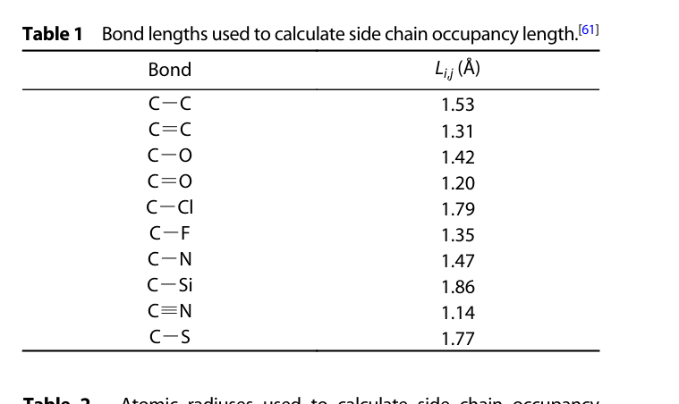

**[图表解读]** 列出了 10 种化学键的键长数据（单位 Å）。C-C 单键最长（1.53 Å），C≡N 三键最短（1.14 Å）。这些数据直接用于 Eq. 2 的计算。

**[关键数据]** C-C = 1.53 Å, C=O = 1.20 Å, C-Cl = 1.79 Å（最长的单键之一），C-F = 1.35 Å。

**[设计意图]** 提供 SOL 计算的查找表，保证可复现性。

---

### Table 2: Atomic radii for SOL calculation

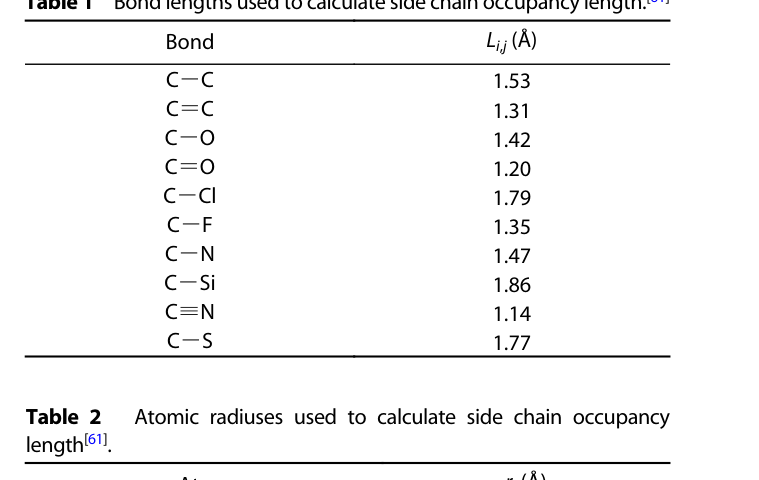

**[图表解读]** 7 种原子的原子半径数据。碳最大（0.76 Å），氟最小（0.61 Å）。Si（1.1 Å）和 S/Cl（1.0 Å）明显比 C/N/O 大，说明含 Si 或 S 的侧链会产生更大的空间占据。

**[关键数据]** C = 0.76 Å, O = 0.65 Å, Si = 1.1 Å（最大）。

**[设计意图]** 与 Table 1 配合，完整提供 SOL 的所有计算参数。

---

### 2.5 Hydrogen Bond（氢键强度）

> **[原文]** "Hydrogen bond power was calculated using a simple additive algorithm. The values for individual hydrogen bonds between different groups were extracted from a previous article."

**[解说]** 氢键强度的计算最简单直接：列出所有可能的氢键供体-受体对（O-H...O=C, N-H...O=C 等），查表得到每种氢键的平均能量（kJ/mol），然后全部加起来。这是一个纯加和模型，不考虑协同效应。公式 (Eq. 3) 看起来很长，但本质就是"数清楚有几个氢键，每个值多少，加起来"。

**[白话翻译]** 氢键强度 = 把所有能形成的氢键一个个数出来，查表加起来。

**[与前文的联系]** 第 3 个描述符，对应"链间相互作用"因素。

---

### Table 3: Hydrogen bond types and their average energy

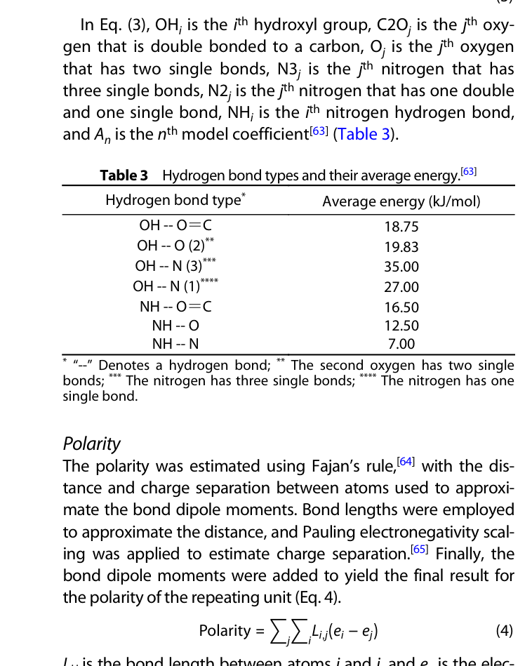

**[图表解读]** 这张表列出了 7 种氢键类型及其平均能量。O-H...N(3) 最强（35.00 kJ/mol），N-H...N 最弱（7.00 kJ/mol）。O-H 作为供体通常比 N-H 形成更强的氢键。

**[关键数据]**
- 最强：OH...N(3) = 35.00 kJ/mol（羟基-胺基）
- 最常见：NH...O=C = 16.50 kJ/mol（酰胺键，聚酰胺/尼龙的关键）
- 最弱：NH...N = 7.00 kJ/mol

**[设计意图]** 这张表是 Eq. 3 中系数 A₁~A₆ 的查找表。值得注意的是 OH...O(2) = 19.83 kJ/mol 和 OH...O=C = 18.75 kJ/mol 非常接近，说明"氧的杂化状态对接受能力影响不大"。

> **[背景补充]** 氢键的能量范围通常在 5-40 kJ/mol，比共价键（200-400 kJ/mol）弱得多，但比范德华力（0.5-5 kJ/mol）强得多。在聚合物中，虽然单个氢键不强，但大量氢键的累积效应可以极大地限制链段运动，显著提高 Tg。

---

### 2.6 Polarity（极性）

> **[原文]** "The polarity was estimated using Fajan's rule, with the distance and charge separation between atoms used to approximate the bond dipole moments. Bond lengths were employed to approximate the distance, and Pauling electronegativity scaling was applied to estimate charge separation."

**[解说]** 极性的计算使用了 Fajan 规则的简化版：

$$\text{Polarity} = \sum_j \sum_i L_{i,j} (e_i - e_j)$$

本质就是**把每个共价键的"偶极矩"加起来**。偶极矩 = 键长 × 电荷分离 ≈ 键长 × 电负性差。C-F 键的极性贡献 = 1.35 × (4.0 - 2.5) = 2.025（很大），而 C-C 键 = 1.53 × (2.5 - 2.5) = 0（无极性）。

**[白话翻译]** 极性 = 所有化学键的"偏心程度"之和。键两端原子电负性差越大，键越长，极性越大。

**[与前文的联系]** 第 4 个也是最后一个描述符，至此 4 个特征全部介绍完毕。

---

### Table 4: Pauling's electronegativity values

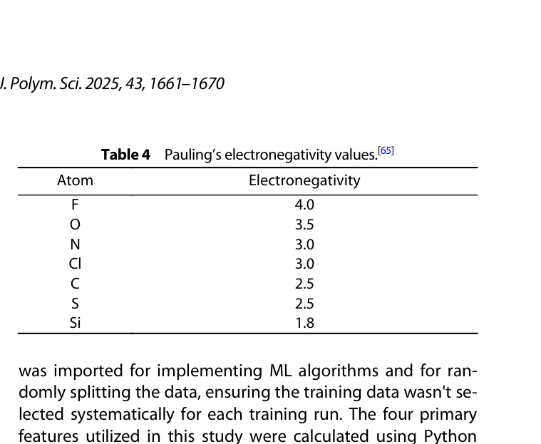

**[图表解读]** 7 种原子的 Pauling 电负性值。F 最高（4.0），Si 最低（1.8）。电负性差越大，键极性越强。F 与 C 的差值 = 1.5（最大），说明含氟聚合物极性最强。

**[关键数据]** F = 4.0, O = 3.5, N = Cl = 3.0, C = S = 2.5, Si = 1.8。

**[设计意图]** Eq. 4 的查找表，与 Table 1 的键长数据配合使用。

---

### 2.7 Modeling（建模细节）

> **[原文]** "The dataset was split into training and test datasets... the first group, comprising 90% of the data, was used for the learning process, whereas the remaining 10% was reserved for evaluating the final models."

**[解说]** 数据划分：90% 训练集（约 101 条）+ 10% 测试集（约 11 条）。90/10 的划分在小数据集上是合理的——数据太少，需要尽量多用于训练。评估指标用了三个：R²（越接近 1 越好）、MAE（平均绝对误差，单位 K）、MAPE（平均绝对百分比误差）。

**[白话翻译]** 90% 数据拿来学习，10% 留着考试。用 R²、MAE、MAPE 三个指标打分。

**[与前文的联系]** Methods 最后一段，交代实验设置细节，为 Results 做准备。

> **[原文]** "We used the permutation feature importance function located in the sklearn module to determine the contribution (significance) of each descriptor to the overall result."

**[解说]** 特征重要性的计算方法是**排列重要性**（Permutation Importance）：把某个特征的值随机打乱，看模型性能下降多少。下降越多，说明模型越依赖这个特征。这种方法是模型无关的（可以用于任何模型），而且比树模型自带的 feature_importances_ 更可靠。

**[白话翻译]** 想知道一个特征有多重要？把它的数据打乱看看——模型性能跌得越狠，这个特征就越关键。

**[与前文的联系]** 预告了 Results 中的特征重要性分析。

---

> **[本节小结]** Methods 定义了完整的技术管线：4 个 ML 模型（RF、ET、GPR、GB）+ 4 个结构描述符（Flexibility、SOL、H-bond Power、Polarity）+ 邻接矩阵表示 + 90/10 数据划分。
>
> 核心信息：(1) 4 个描述符全部可从结构计算，不需实验数据 (2) ET 的"额外随机性"使其抗噪声 (3) GPR 提供不确定性估计 (4) 排列重要性用于评估特征贡献

---

## 3. Results and Discussion (pp. 4-8)

### 3.1 ML Algorithms Results

#### 第 1 段：超参数和最优设置

> **[原文]** "Through systematic experimentation, we determined that the Extra Trees algorithm yields the best results when the number of estimators is set to 179, the Random Forest algorithm performs optimally at 183 estimators, the Gradient Boosting algorithm excels at 103 estimators, and the Gaussian Process Regression algorithm achieves the best performance with the RBF kernel."

**[解说]** 超参数调优结果：ET 用 179 棵树，RF 用 183 棵，GB 用 103 棵。GB 的树数远少于 RF/ET，因为 GB 是串行训练（每棵树修正前一棵的残差），太多树容易过拟合。GPR 使用 RBF（径向基函数）核，这是最常用的核函数，能建模平滑的非线性关系。

**[白话翻译]** 每种模型都调出了最优参数：ET 用 179 棵树效果最好，GPR 用 RBF 核最好。

**[与前文的联系]** 进入正式的实验结果展示。

---

### Figure 3: Predicted versus real Tg values (4-panel)

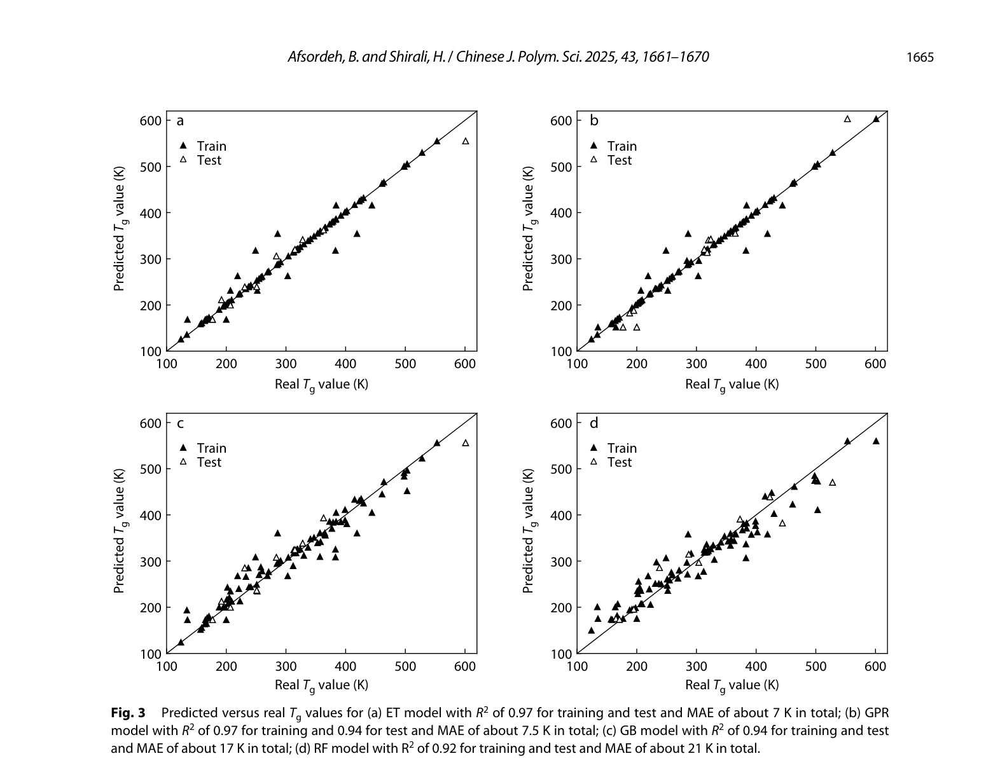

**[图表解读]** 这是全文最重要的结果图之一。四个子图分别展示 ET、GPR、GB、RF 的预测值 vs 实际值散点图。理想情况下所有点应落在对角线上（预测=实际）。

- **(a) ET**: 训练集和测试集的点都紧贴对角线，R² = 0.97，散布极小
- **(b) GPR**: 训练集紧贴对角线（R² = 0.97），但测试集有少量偏离（R² = 0.94）
- **(c) GB**: 点的散布明显增大，尤其在高 Tg 区域
- **(d) RF**: 散布最大，高 Tg 区域的预测明显偏低

**[关键数据]** ET 是唯一在训练集和测试集上都达到 R² = 0.97 的模型，说明它既准确又不过拟合。

**[设计意图]** 直观展示四种模型的预测能力差异。通过散点图，读者一眼就能看出 ET 最优、RF 最差。

---

### Table 5: Performance summary of each ML model

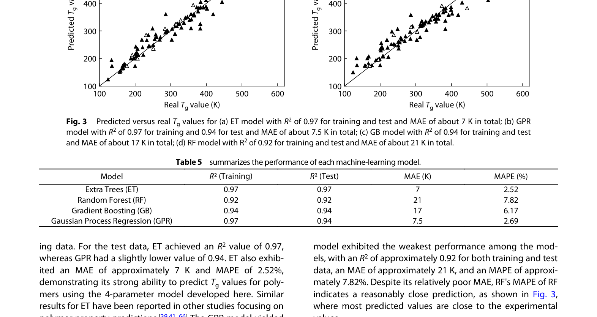

**[图表解读]** 四种模型性能的精确数值总结：

| 模型 | R²(Train) | R²(Test) | MAE(K) | MAPE(%) |
|------|-----------|----------|--------|---------|
| ET   | 0.97      | 0.97     | 7      | 2.52    |
| GPR  | 0.97      | 0.94     | 7.5    | 2.69    |
| GB   | 0.94      | 0.94     | 17     | 6.17    |
| RF   | 0.92      | 0.92     | 21     | 7.82    |

**[关键数据]**
- ET 最优：MAE = 7 K（平均只偏差 7 度），MAPE = 2.52%
- ET vs GPR：ET 测试集 R² = 0.97 vs GPR 0.94，说明 GPR 存在轻微过拟合
- RF 最差：MAE = 21 K，是 ET 的 3 倍

**[设计意图]** 用精确数据支撑 Fig. 3 的视觉印象，证明 ET 是最佳模型。

---

#### 第 2 段：ET 和 GPR 的详细分析

> **[原文]** "The best-performing models were ET and GPR, both achieving R² values of approximately 0.97 for the training data. For the test data, ET achieved an R² value of 0.97, whereas GPR had a slightly lower value of 0.94."

**[解说]** ET 的优势很明显：训练集和测试集 R² 都是 0.97，说明模型学到了真实规律而非噪声。GPR 训练集 R² = 0.97 但测试集降到 0.94——这是轻微过拟合的信号。作者认为原因是 GPR 的"收敛问题"——GPR 在优化核函数参数时可能陷入局部最优。

**[白话翻译]** ET 和 GPR 都很好（R² ≈ 0.97），但 ET 在新数据上更稳定，GPR 有点"背题"倾向。

**[与前文的联系]** 对 Fig. 3 和 Table 5 的数据进行文字解释。

---

#### 第 3 段：GB 和 RF 的分析

> **[原文]** "The GB model performed worse than ET and GPR, with R² values of approximately 0.94... The RF model exhibited the weakest performance among the models, with an R² of approximately 0.92."

**[解说]** GB（R² = 0.94, MAE = 17 K）和 RF（R² = 0.92, MAE = 21 K）明显弱于 ET/GPR。但有趣的是，RF 的 MAPE = 7.82% 并不算太高——虽然绝对误差大（21 K），但大部分偏差发生在高 Tg 聚合物上（500+ K），相对来说偏差比例并不离谱。

**[白话翻译]** GB 和 RF 比 ET 差不少，但也不算太差——对角线附近大部分点还是靠谱的。

**[与前文的联系]** 完成四种模型的横向对比。

---

#### 第 4 段：与其他研究的对比

> **[原文]** "When compared with other published studies, these results represent a significant improvement in the machine learning models' ability to predict Tg."

**[解说]** 作者与 Introduction 中综述的 6 项先前研究做了正面对比。ET 的 R² = 0.97 和 MAE = 7 K，超过了所有先前研究的最佳结果。特别值得注意的是 Armeli et al. 的两种方法（SMILES 和官能团+Tm）MAE ≈ 12-13 K，而本文 ET 只有 7 K。更关键的是，Armeli et al. **用了 Tm 作为输入**（需要实验数据），而本文完全不需要。

**[白话翻译]** 不仅不用做实验，预测还比用了实验数据的方法更准——这就是好特征的威力。

**[与前文的联系]** 回应 Introduction 中的文献综述，证明本文的进步。

---

### Table 6: Comparison with other studies

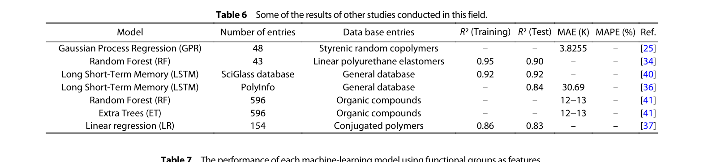

**[图表解读]** 横向对比表，列出了 7 项先前研究的数据集大小、R²、MAE 等指标。

**[关键数据]**
- 最好的先前研究：Armeli et al. (596 条数据) MAE = 12-13 K
- 本文 ET：(112 条数据) MAE = 7 K —— 数据量仅为前者的 1/5，但精度提高近一倍
- Zhang et al. 的 MAE = 3.8 K 看起来更好，但那是在 48 条同族聚合物上（太单一）

**[设计意图]** 这张表是全文最有说服力的结果之一——在更小、更多样的数据集上，用更简单的纯结构特征，达到了更高的精度。

---

#### 第 5 段：官能团特征 vs 结构特征对比

> **[原文]** "To evaluate our results, we ran the models using the same hyperparameters as before, but this time incorporating functional group features, such as the number of double carbon bonds, ester and amide functional groups, and benzene structures."

**[解说]** 这是全文最精彩的对比实验之一。作者用 **13 个传统官能团特征**（双键数、酯基数、酰胺基数、苯环数等）替换自己的 4 个描述符，在完全相同的模型和超参数下重新训练。结果：

**[白话翻译]** 同样的模型，换了特征后效果天差地别——4 个好特征完胜 13 个烂特征。

**[与前文的联系]** 控制变量实验：只改特征不改模型，证明性能提升来自特征而非模型。

---

### Table 7: Performance using functional group features

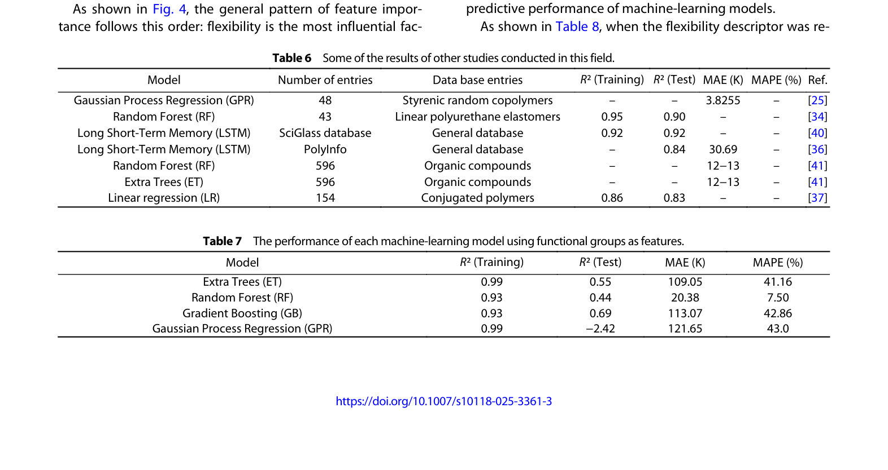

**[图表解读]** 使用官能团特征的性能——灾难性结果：

| 模型 | R²(Train) | R²(Test) | MAE(K) | MAPE(%) |
|------|-----------|----------|--------|---------|
| ET   | 0.99      | 0.55     | 109.05 | 41.16   |
| RF   | 0.93      | 0.44     | 20.38  | 7.50    |
| GB   | 0.93      | 0.69     | 113.07 | 42.86   |
| GPR  | 0.99      | **-2.42**| 121.65 | 43.0    |

**[关键数据]**
- ET: R²(Test) 从 0.97 暴跌到 0.55，MAE 从 7 K 飙升到 109 K（增长 15 倍！）
- GPR: R²(Test) = **-2.42**，这意味着模型预测还不如直接取平均值
- 所有模型 R²(Train) 很高但 R²(Test) 暴跌——典型的**严重过拟合**

**[设计意图]** 这张表是"特征质量 >> 特征数量"最有力的实证。13 个官能团特征 → 严重过拟合；4 个物理驱动特征 → R² = 0.97。原因在于官能团特征（如"苯环数"）**不直接编码 Tg 的物理机制**，模型只能死记硬背训练集，无法泛化。

> **[背景补充]** R² = -2.42 意味着什么？R² 的定义是 $1 - SS_{res}/SS_{tot}$，当残差平方和大于总方差时 R² 为负。直觉上说，如果一个模型的预测比"所有样本取平均值"还差，R² 就是负数。GPR 在这种特征下完全崩溃了。

---

### 3.2 Features Importance（特征重要性分析）

#### 第 1 段：特征重要性排序

> **[原文]** "As shown in Fig. 4, the general pattern of feature importance follows this order: flexibility is the most influential factor, followed by side chain occupancy length, hydrogen bond strength, and polarity."

**[解说]** 排列重要性分析的结论：**Flexibility >> SOL > H-bond > Polarity**。这个排序在 4 个模型中高度一致（GPR 例外——它把极性排在氢键前面）。作者给出的物理解释很有洞察力：数据集中大部分聚合物是非极性的，链间以弱范德华力为主，所以链本身的柔性成为决定 Tg 的头号因素。

**[白话翻译]** 柔性是 Tg 最大的"推手"，其次是侧链体积，氢键和极性相对次要。

**[与前文的联系]** 用数据验证了 Introduction 中的物理直觉：链段运动（柔性）是 Tg 的本质。

---

### Figure 4: Feature significance (4 models)

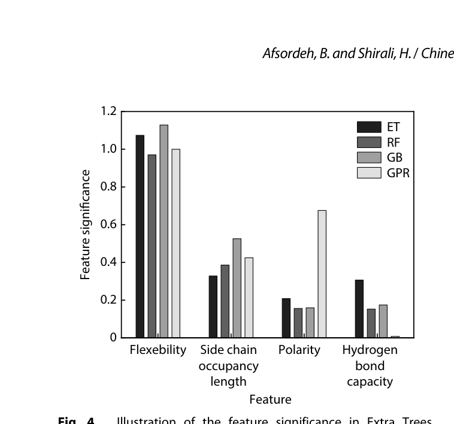

**[图表解读]** 四种模型的特征重要性柱状图。横轴是 4 个特征，纵轴是重要性分数。

- **Flexibility**: 在所有模型中都是最高的（ET ≈ 1.1, RF ≈ 0.7, GB ≈ 0.5, GPR ≈ 0.7）
- **SOL**: 第二重要（ET ≈ 0.3, RF ≈ 0.2）
- **H-bond**: 在 ET/RF/GB 中排第三，但 GPR 中排最低
- **Polarity**: 在 ET/RF/GB 中最低，但 GPR 中排第二

**[关键数据]** ET 模型中 Flexibility 的重要性（~1.1）是 SOL（~0.3）的 3-4 倍。

**[设计意图]** 可视化展示特征重要性的共识排序，同时揭示 GPR 的"异类行为"——GPR 对极性的依赖高于预期。

---

#### 第 2 段：为什么柔性最重要

> **[原文]** "Chain flexibility emerges as the primary factor in determining Tg because it directly affects the movement of polymer chain segments, which is central to the concept of Tg."

**[解说]** 这段的论证逻辑非常清晰：Tg 的物理定义 = 链段运动解冻的温度 → 什么最直接影响链段能不能动？→ 链本身的柔性/刚性。其他因素（体积、氢键、极性）都是**间接**影响——它们通过改变链段运动的"阻力"来影响 Tg，但柔性是"运动自由度"本身。

**[白话翻译]** Tg 就是"链段什么时候能动"，而柔性直接决定"链段多容易动"——所以它最重要。

**[与前文的联系]** 把数据结果（Fig. 4）和物理原理（Introduction 第 3 段）连接起来。

---

#### 第 3 段：SOL 第二重要的原因

> **[原文]** "The second most important feature is the side chain occupancy length, which is expected, as the occupied (or free) volume plays a critical role in indirectly influencing the mobility of chain segments."

**[解说]** SOL 排第二也符合物理预期：即使链本身很柔，如果链之间太拥挤（自由体积太小），链段也动不了。SOL 就是度量"拥挤程度"的指标。

**[白话翻译]** 侧链越大占位越多，就像走廊越窄越难走——即使腿再灵活也走不快。

**[与前文的联系]** 解释 Fig. 4 中 SOL 排名第二的物理原因。

---

#### 第 4 段：氢键排第三的原因

> **[原文]** "Hydrogen bond strength ranks third because only approximately 21% of the structures in our database are capable of forming hydrogen bonds."

**[解说]** 关键数据：数据集 112 种聚合物中只有约 21%（~24 种）能形成氢键。虽然氢键是最强的非共价相互作用之一，但因为大部分聚合物**根本没有氢键**，模型学到的"氢键效应"在统计上被稀释了。

**[白话翻译]** 氢键虽强，但数据集里只有 1/5 的聚合物有氢键，所以整体影响不突出。

**[与前文的联系]** 从数据分布角度解释，而非仅从物理角度。

---

### Figure 5: Polymers with hydrogen bond power

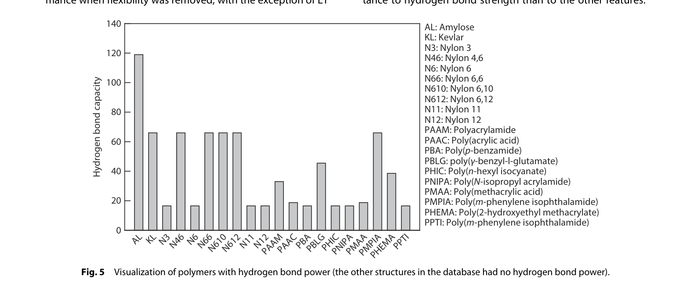

**[图表解读]** 展示数据集中所有具有氢键能力的聚合物及其氢键强度值。共 20 种聚合物被列出（包括各种尼龙、聚丙烯酰胺、聚丙烯酸等）。

**[关键数据]**
- 氢键最强的是 PPTI/PMPIA（聚间苯二甲酰间苯二胺，类似 Kevlar 结构），约 120+ kJ/mol
- 大部分含氢键聚合物的值在 20-80 kJ/mol 范围
- 有 Amylose（直链淀粉）、Kevlar 等特殊结构

**[设计意图]** 直观展示"只有少数聚合物有氢键"这一事实，以及这些聚合物的氢键强度分布。

---

#### 第 5 段：极性最不重要的原因

> **[原文]** "Polarity is the least important factor for predicting the Tg of polymers. This is because the interactions driven by polarity are generally weak, as most of the interactions between the polymer chains are governed by van der Waals forces."

**[解说]** 极性排最后有两个原因：(1) 极性引起的偶极-偶极相互作用本身就比氢键弱得多 (2) 极性信息可能被其他特征部分编码——比如一个高极性的侧链（含 F、Cl）也会增加 SOL 值。

**[白话翻译]** 极性引起的力太弱，对链运动的限制不够大，所以对 Tg 影响最小。

**[与前文的联系]** 完成 4 个特征的重要性排序分析。

---

### 消融实验（Ablation Study）

#### 第 6 段：消融实验设计

> **[原文]** "To further assess the importance of each descriptor, each model was retrained under the same conditions as in the original experiments but with one descriptor removed at a time."

**[解说]** 消融实验是检验特征重要性的"金标准"：每次移除一个特征，看模型性能掉多少。这比排列重要性更直接——排列重要性是"打乱一个特征"，消融是"彻底删掉一个特征"。两种方法如果结论一致，说明特征重要性排序是可靠的。

**[白话翻译]** 想知道一个零件有多重要？拆掉它看看整台机器还能不能正常运行。

**[与前文的联系]** 用第二种独立方法验证 Fig. 4 的结论。

---

### Table 8: Ablation experiment results

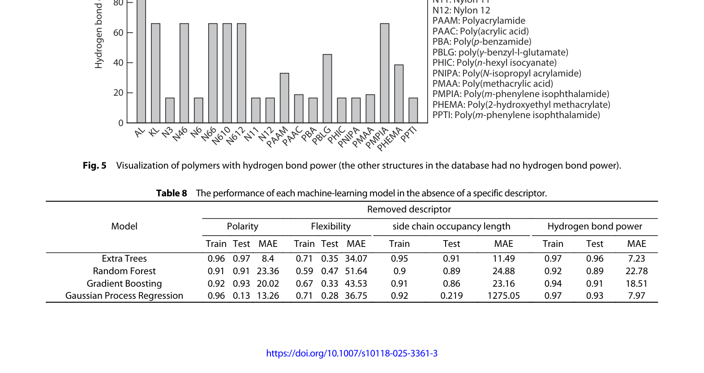

**[图表解读]** 这是全文最核心的实验数据表之一。每列对应移除一个特征后的模型性能：

**移除 Flexibility（最致命）：**
- ET: R²(Test) 从 0.97 → **0.35**, MAE 从 7 → **34 K**（崩溃）
- RF: R²(Test) 从 0.92 → **0.47**, MAE 从 21 → **52 K**
- GB: R²(Test) 从 0.94 → **0.33**, MAE 从 17 → **44 K**
- GPR: R²(Test) 从 0.94 → **0.28**, MAE 从 7.5 → **37 K**

**移除 SOL（影响大但 ET 抗住了）：**
- ET: R²(Test) 从 0.97 → 0.91, MAE 从 7 → 11.5 K（小幅下降）
- GPR: R²(Test) 从 0.94 → **0.219**, MAE 飙升到 **1275 K**（完全崩溃）

**移除 Polarity（GPR 受影响最大）：**
- ET: R²(Test) 0.97（几乎不变！MAE 只增加到 8.4 K）
- GPR: R²(Test) → **0.13**（崩溃）

**移除 H-bond（影响最小）：**
- 所有模型性能几乎不变（ET: 0.96, GPR: 0.93）

**[关键数据]**
- Flexibility 移除后**所有 4 个模型**的 R²(Test) 都低于 0.5 → **绝对核心特征**
- H-bond 移除后所有模型 R² 几乎不变 → 可以认为"不是必需的"
- GPR 对任何特征的移除都极其敏感（频繁崩溃），说明 GPR 的鲁棒性最差

**[设计意图]** 通过消融实验确认：Flexibility 是唯一的"不可或缺"特征。其他特征的重要性因模型而异。

> **[背景补充]** GPR 的 MAE = 1275 K（移除 SOL 后）是一个极端异常值。正常聚合物 Tg 范围是 100-600 K，预测偏差 1275 K 说明模型完全失控了。这可能是因为 GPR 的 RBF 核在低维度（3 个特征）下的超参数没有重新优化，导致严重外推。

---

#### 第 7 段：移除 SOL 后 ET 的表现

> **[原文]** "When the side-chain occupancy length descriptor was removed, most models showed a similar decline in performance when flexibility was removed, with the exception of ET and GPR. The ET model continued to produce relatively strong predictions."

**[解说]** ET 在移除 SOL 后仍然保持 R² = 0.91（MAE = 11.5 K），这揭示了一个重要信息：ET 模型**主要依赖 Flexibility**，对 SOL 的依赖较弱。可能的原因是 Flexibility 和 SOL 之间有一定的信息冗余——大侧链通常也会降低柔性。

**[白话翻译]** ET 少了侧链特征也能勉强支撑，因为它主要靠柔性特征干活。

**[与前文的联系]** 深入分析 Table 8 中 ET 的特殊表现。

---

### Figure 6: Feature significance after removing SOL

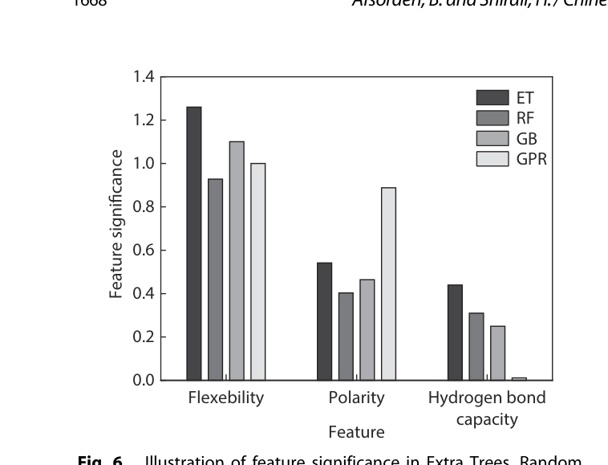

**[图表解读]** 移除 SOL 后剩余 3 个特征的重要性。对比 Fig. 4（有 SOL 时），Flexibility 的重要性进一步增大，说明 SOL 被移除后其信息部分被 Flexibility 吸收。

**[关键数据]** 移除 SOL 后，GPR 把几乎所有权重都放在了 Flexibility 上，导致对极性和氢键的利用不足，最终严重过拟合。

**[设计意图]** 展示特征之间的信息互补关系——移除一个特征后，其他特征的重要性如何重新分配。

---

#### 第 8 段：移除氢键强度的影响

> **[原文]** "Finally, removing the hydrogen bond strength descriptor did not significantly affect the performance of most of the models."

**[解说]** 氢键移除后影响最小——这与 Fig. 4 的排序一致，也与"数据集中仅 21% 有氢键"这一事实吻合。但这**不代表氢键不重要**——如果数据集中含氢键聚合物更多，氢键特征的重要性会显著增加。这是一个数据分布决定特征重要性的典型案例。

**[白话翻译]** 去掉氢键特征几乎没影响——因为大部分聚合物根本没有氢键。

**[与前文的联系]** 消融实验的最后一组结论，与 Fig. 5（仅 20 种有氢键）遥相呼应。

---

> **[本节小结]** Features Importance 部分用两种独立方法（排列重要性 + 消融实验）得出一致结论：**Flexibility 是预测 Tg 的绝对核心特征**（移除后所有模型 R² < 0.5），SOL 第二重要但并非不可替代（ET 没有 SOL 仍有 R² = 0.91），H-bond Power 几乎可以省略。
>
> 关键洞察：(1) 4 个好特征 >> 13 个官能团特征（Table 7 vs Table 5）(2) GPR 鲁棒性最差（对特征删除极敏感）(3) 特征重要性部分取决于数据集分布

---

### 3.3 Investigation of the Largest Deviations（最大偏差分析）

#### 第 1 段：异常聚合物分析

> **[原文]** "Examination of the outliers in the best-performing models (ET and GPR) revealed that the largest deviations occurred in polymers such as poly(4-methylpentene-1) (PMP) and poly(hexane-1) (PHE). These polymers share two key characteristics: they have long side chains with only two atoms in their main chain."

**[解说]** 最大偏差出现在"主链极短、侧链极长"的聚合物上。作者给出了精彩的物理解释：这类聚合物的侧链之间可能形成**纠缠网络**（entanglement），限制了链段运动、提高了 Tg。但当前的 Flexibility 描述符只考虑了主链柔性，没有捕获侧链纠缠效应。

**[白话翻译]** 模型预测最不准的是"短主链+长侧链"的聚合物——因为它们的侧链会互相缠绕，这个效应模型没有学到。

**[与前文的联系]** 对 Fig. 3 中偏离对角线最远的点进行根因分析。

> **[具体例子]** 聚(4-甲基戊烯-1)（PMP）的主链只有 2 个碳，但侧链有 3 个碳+1 个甲基分支。想象一下：主链像一根很短的绳子，两端挂着很长的穗子——这些穗子之间会互相缠绕，让"绳子"变得很难移动。模型只看到了"绳子很柔软"，但没看到"穗子缠住了"。

---

#### 第 2 段：电荷转移复合物的影响

> **[原文]** "One possible reason is the presence of charge-transfer complexes, which involve electron donor/acceptor relationships between different functional groups. This phenomenon can lead to the formation of new intramolecular or intermolecular bonds, potentially immobilizing chain movement."

**[解说]** 作者指出了另一个当前模型未捕获的效应：电荷转移复合物（CTC）。当供电子基团（如氨基）和受电子基团（如羰基）相邻时，可以形成额外的分子间作用力。这种力不算在氢键或极性中，但确实会限制链运动。作者建议未来可以用 DFT 计算这种相互作用。

**[白话翻译]** 有些聚合物的链之间有"暗力"（电荷转移），当前 4 个特征没有涵盖。

**[与前文的联系]** 继续分析模型预测偏差的来源，指出改进方向。

---

#### 第 3 段：实验测量误差

> **[原文]** "Another important factor to consider is the measurement error associated with determining Tg. These methods often yield slightly different results owing to differences in the experimental setups."

**[解说]** 最后一个误差来源是实验本身。DSC 和 DMA 测出的 Tg 可以相差几度到十几度；尼龙等聚合物会吸湿，水分作为增塑剂会降低 Tg。考虑到这些不可控因素，MAE = 7 K 的精度已经**接近实验误差本身**，进一步提高可能需要更精确的实验数据。

**[白话翻译]** 实验测 Tg 本身就有几度误差，所以 MAE = 7 K 可能已经接近物理极限了。

**[与前文的联系]** 为模型性能的上限提供了物理解释——不是模型不够好，是数据噪声限制了精度。

---

> **[本节小结]** 最大偏差分析揭示了模型的局限性和改进方向：(1) 侧链纠缠效应未被当前特征捕获 (2) 电荷转移复合物是潜在的新描述符 (3) 实验测量误差限制了精度上限。
>
> 核心信息：MAE = 7 K 已接近实验误差本身，但仍有改进空间（纠缠、CTC）

---

## 4. Conclusions (p. 8)

> **[原文]** "The structural repeating units of the polymers were represented as matrices using molecular graph theory. Key physical and interaction-related data were extracted from these matrices, including flexibility, side chain occupancy length, polarity, and hydrogen bonding... Extra Trees and GPR demonstrated the highest predictive accuracy, with R² values around 0.97 and MAE values of approximately 7 and 7.5 K, respectively."

**[解说]** Conclusions 简洁地总结了全文贡献：(1) 用邻接矩阵表示聚合物结构 (2) 提取 4 个物理驱动的描述符 (3) ET 和 GPR 达到 R² ≈ 0.97 的高精度 (4) Flexibility 是最关键的特征 (5) 相比先前研究有显著提升。

**[白话翻译]** 我们用 4 个简单的结构特征就让模型达到了 0.97 的精度，关键是选对了特征。

**[与前文的联系]** 回顾全文，呼应 Introduction 的研究目标。

> **[原文]** "Feature importance analysis showed that flexibility was consistently the most significant factor in predicting Tg, whereas interaction-related features such as polarity and hydrogen bonding were less impactful."

**[解说]** 最后强调了特征重要性的结论。注意措辞"consistently"——这是跨模型的一致发现，而不是某个特定模型的偶然结果。

**[白话翻译]** 不管用哪种模型，柔性都是 Tg 预测最重要的因素——这是确定无疑的。

**[与前文的联系]** 总结性陈述，升华全文核心贡献。

---

> **[本节小结]** 结论部分简明扼要，核心贡献可归纳为一句话：**仅用 4 个从重复单元结构计算的物理描述符，就能以 R² = 0.97 的精度预测聚合物 Tg，证明了特征质量远比特征数量重要。**

---

## 全文总结

### 一句话总结

仅用 4 个物理驱动的结构描述符（柔性、侧链占据长度、氢键强度、极性），Extra Trees 模型就能以 R² = 0.97、MAE = 7 K 的精度预测聚合物 Tg，超越了所有使用更复杂特征或更大数据集的先前研究。

### 核心贡献 (5 条)

1. **物理驱动的特征工程**：4 个描述符直接对应影响 Tg 的三类物理因素（链柔性、自由体积、链间作用力），不需要任何实验数据输入
2. **特征质量 > 特征数量**：4 个结构特征（R² = 0.97）全面碾压 13 个官能团特征（R² = 0.55），是"少即是多"的最佳实证
3. **Flexibility 是 Tg 的核心预测因子**：排列重要性和消融实验双重验证——移除 Flexibility 后所有模型 R² 暴跌至 0.28-0.47
4. **ET 模型的鲁棒性**：Extra Trees 在训练集和测试集上都达到 R² = 0.97，对特征删除也最稳健
5. **纯结构预测的可行性**：证明了从聚合物重复单元出发，无需实验数据，就能实现高精度 Tg 预测

### 最重要的图表

- **Table 7** (官能团 vs 结构特征对比): 因为它是"特征质量 >> 特征数量"最有力的证据
- **Table 8** (消融实验): 因为它定量展示了每个特征对模型的贡献
- **Figure 3** (预测 vs 实际散点图): 因为它直观展示了模型的预测精度
- **Figure 4** (特征重要性柱状图): 因为它确认了 Flexibility 的核心地位

### 延伸阅读建议

- 如果想深入了解 **Extra Trees 算法**，推荐阅读 Geurts et al. (2006) "Extremely Randomized Trees" — Machine Learning 63, 3-42
- 如果想了解 **聚合物 Tg 的物理理论**，推荐 Mark (2009) Polymer Data Handbook 和 Bicerano (2002) Prediction of Polymer Properties
- 如果想了解 **ML 在聚合物领域的更多应用**，推荐 Tao et al. (2021) "Benchmarking ML models for polymer informatics" — J. Chem. Inf. Model.
- 如果想了解 **特征重要性分析方法**，推荐 Lundberg & Lee (2017) "A Unified Approach to Interpreting Model Predictions" (SHAP 的原始论文)
- 如果想了解 **本项目如何使用这篇论文的发现**，参见项目的 `KNOWLEDGE_NOTES.md` 中"Afsordeh 4 特征消融实验的深层启示"条目
