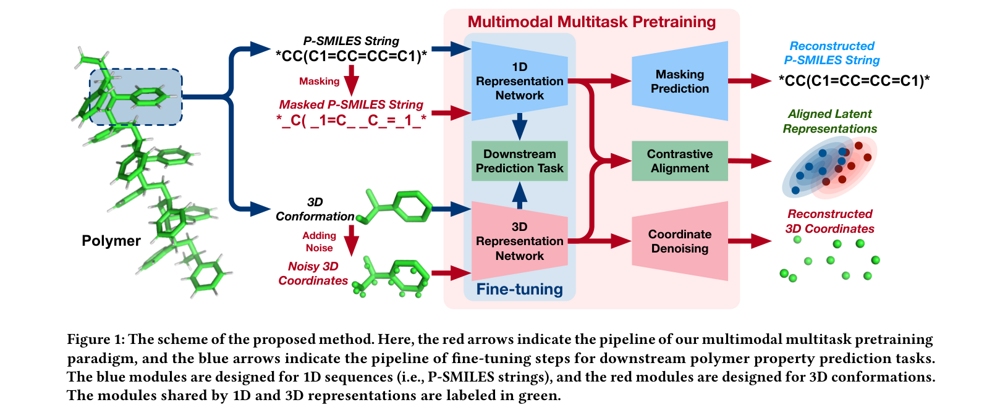
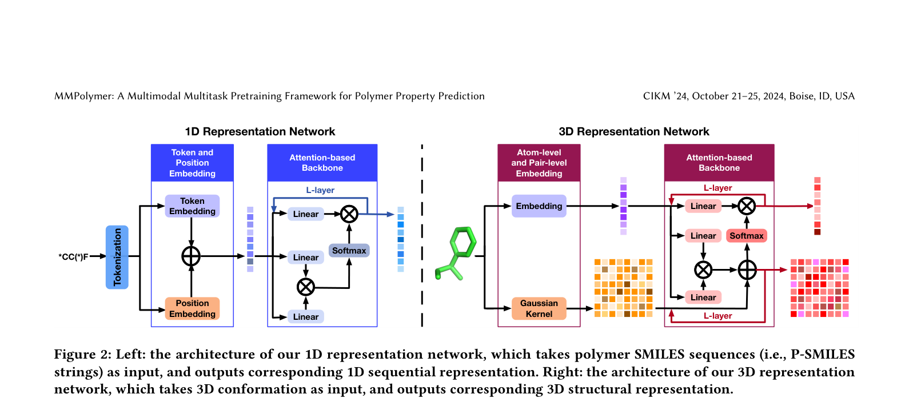
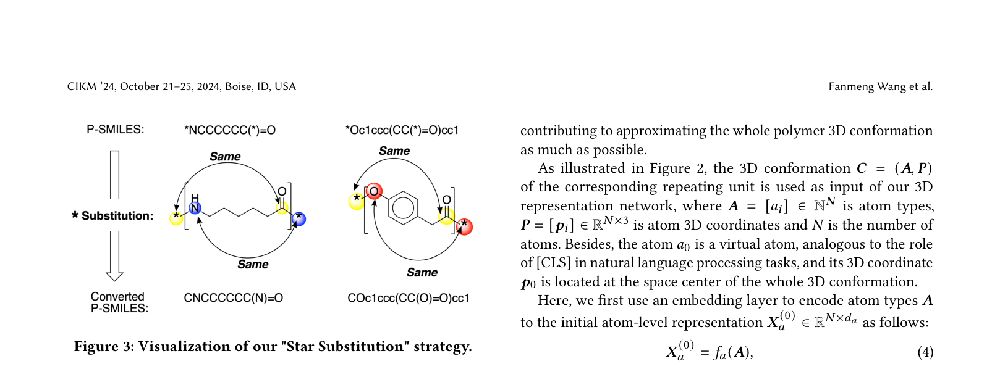
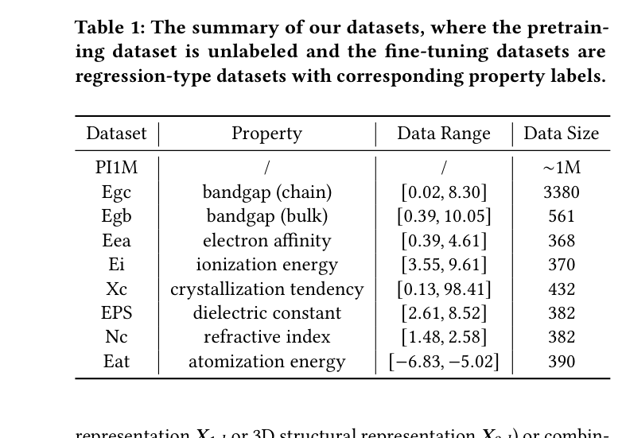
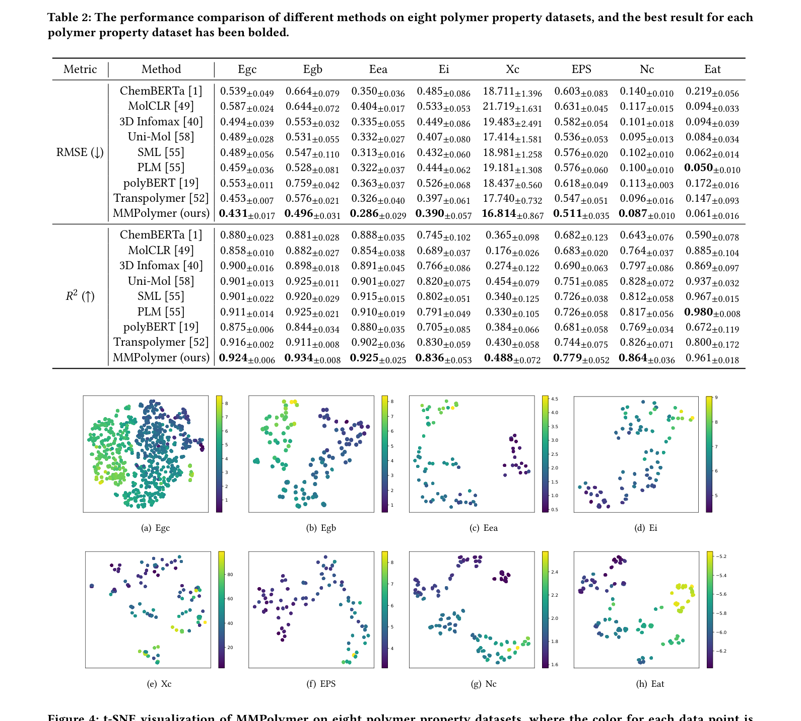
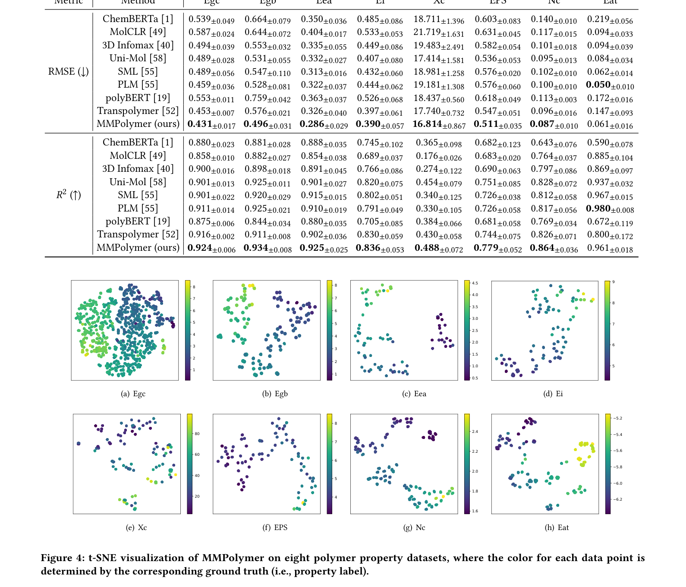
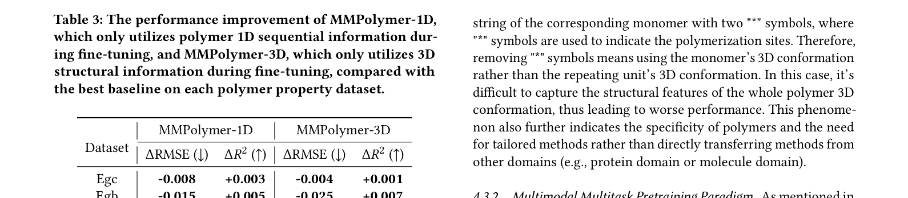
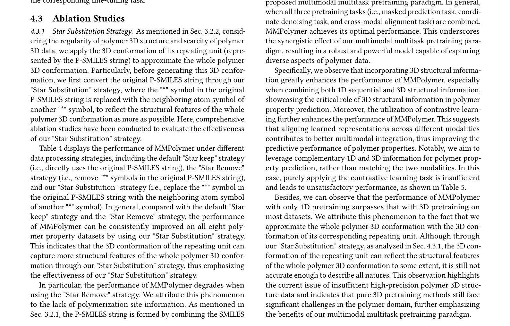
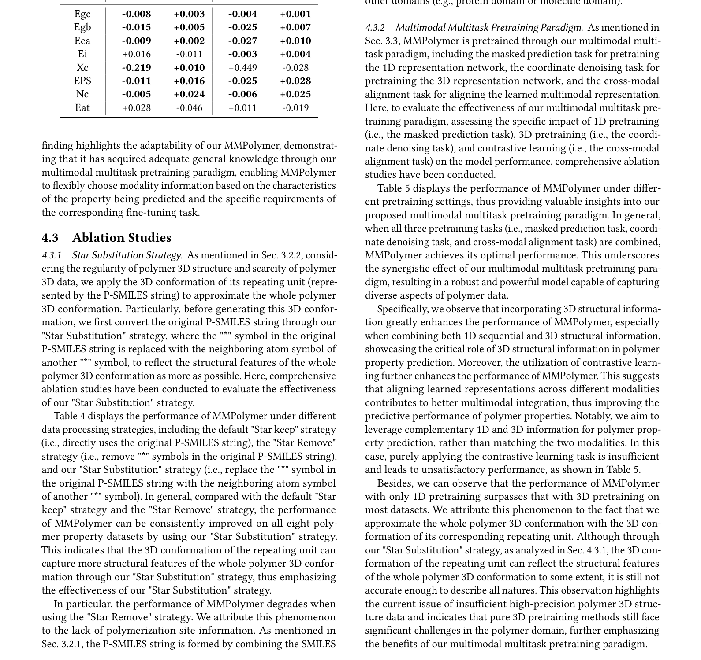

# MMPolymer: A Multimodal Multitask Pretraining Framework for Polymer Property Prediction — 论文全文精讲

> 生成日期：2026-03-08
> 预计阅读时间：70 分钟
> 图表数量：4 张图 + 5 张表

## 论文信息

- **标题**: MMPolymer: A Multimodal Multitask Pretraining Framework for Polymer Property Prediction
- **作者**: Fanmeng Wang, Wentao Guo, Minjie Cheng, Shen Yuan, Hongteng Xu, Zhifeng Gao
- **会议**: CIKM '24 (The 33rd ACM International Conference on Information and Knowledge Management), October 21–25, 2024, Boise, ID, USA
- **arXiv**: 2406.04727
- **页数**: 11 pages (含参考文献)

## 全文结构概览

```
1. Abstract (p. 1)
2. Introduction (pp. 1-2)
3. Related Work (pp. 2-3)
   2.1 Polymer Property Prediction
   2.2 Pretraining for Molecular Modeling
4. Method (pp. 3-6)
   3.1 Overview
   3.2 Representation Networks
       3.2.1 1D Representation Network
       3.2.2 3D Representation Network ("Star Substitution")
   3.3 Learning Paradigm
       3.3.1 Masked Prediction Task
       3.3.2 Coordinate Denoising Task
       3.3.3 Cross-Modal Alignment Task
       3.3.4 Fine-tuning Task
5. Experiments (pp. 6-9)
   4.1 Experimental Setup
   4.2 Performance Comparison
   4.3 Ablation Studies
6. Conclusion (p. 9)
7. References (pp. 10-11)
```

---

## 1. Abstract (p. 1)

> **[原文]** "Polymers are high-molecular-weight compounds constructed by the covalent bonding of numerous identical or similar monomers so that their 3D structures are complex yet exhibit unignorable regularity. Typically, the properties of a polymer, such as plasticity, conductivity, bio-compatibility, and so on, are highly correlated with its 3D structure."

**[解说]** 论文开门见山指出聚合物的核心特征：它是由大量单体通过共价键连接形成的大分子，3D 结构复杂但有规律性。作者强调聚合物性质（塑性、导电性、生物相容性等）与其三维结构高度相关。这为后续引入 3D 信息做了铺垫。

**[白话翻译]** 聚合物是重复单元拼出来的大分子，它的性能跟立体结构密切相关。

**[与前文的联系]** 这是全文第一段，直接定义了研究对象和核心假设。

---

> **[原文]** "However, existing polymer property prediction methods heavily rely on the information learned from polymer SMILES sequences (P-SMILES strings) while ignoring crucial 3D structural information, resulting in sub-optimal performance."

**[解说]** 这是论文要解决的核心问题：现有方法只用 1D 序列（P-SMILES 字符串）做预测，完全忽略了三维结构信息。作者用 "sub-optimal" 明确指出这是性能瓶颈。

**[白话翻译]** 现有方法只看聚合物的"文字描述"（SMILES），不看它的"立体形状"，所以效果不够好。

**[与前文的联系]** 承接第一段"性质与 3D 结构相关"的论点，指出现有方法缺失了这个关键信息。

> **[背景补充]** P-SMILES (Polymer SMILES) 是一种用字符串表示聚合物重复单元的方法。普通 SMILES 用于小分子（如乙醇 CCO），而 P-SMILES 在两端加 `*` 号标记聚合位点，如 `*CC(C1=CC=CC=C1)*` 表示聚苯乙烯的重复单元。`*` 的意思是"这里可以继续连下去"。

---

> **[原文]** "In this work, we propose MMPolymer, a novel multimodal multitask pretraining framework incorporating polymer 1D sequential and 3D structural information... Besides, considering the scarcity of polymer 3D data, we further introduce the 'Star Substitution' strategy to extract 3D structural information effectively."

**[解说]** 作者提出了 MMPolymer 框架，核心创新有两个：(1) 多模态——同时利用 1D 序列和 3D 结构两种信息；(2) 多任务预训练——通过掩码预测、坐标去噪、跨模态对齐三个任务联合训练。另外，针对聚合物 3D 数据稀缺的问题，提出了 "Star Substitution"（星号替换）策略来生成近似的 3D 构象。

**[白话翻译]** 我们提出了 MMPolymer：同时看文字和立体结构，还发明了一个巧妙的小技巧（星号替换）来解决 3D 数据不够用的问题。

**[与前文的联系]** 直接回应了上一段提出的问题——"忽略 3D 信息"，这里给出了解决方案。

---

> **[原文]** "Experiments show that MMPolymer achieves state-of-the-art performance in downstream property prediction tasks. Moreover, given the pretrained MMPolymer, utilizing merely a single modality in the fine-tuning phase can also outperform existing methods."

**[解说]** 这是实验结论的摘要：MMPolymer 不仅在多模态下达到最优，而且即使微调时只用一种模态（1D 或 3D），也能超过现有最好的方法。这说明预训练阶段的多模态学习已经将两种模态的信息互相融合、编码进了模型中。

**[白话翻译]** 实验证明 MMPolymer 效果最好，而且预训练学到的知识足够强，微调时只用一种输入也比别人强。

**[与前文的联系]** 摘要的结论部分，概括了后文第 4 节实验的核心发现。

---
> **[本节小结]** 摘要告诉我们：聚合物性质与 3D 结构强相关，但现有方法只用 1D 序列。MMPolymer 通过多模态多任务预训练 + Star Substitution 策略弥补了这一缺陷，在 8 个数据集上达到 SOTA。
---

## 2. Introduction (pp. 1-2)

> **[原文]** "Polymers... are ubiquitous in our daily lives... Among many important properties, glass transition temperature (Tg), plasticity, conductivity, bio-compatibility, and so on, determine their functionality and applications."

**[解说]** 引言第一段介绍聚合物的重要性和应用场景。作者提到了玻璃化转变温度（Tg）、塑性、导电性等关键性质，强调这些性质决定了聚合物的功能和应用。

**[白话翻译]** 聚合物无处不在，它们的性能好不好取决于 Tg、塑性等关键指标。

**[与前文的联系]** 从摘要的概括过渡到对研究背景的详细展开。

---

> **[原文]** "Traditional experimental or theoretical approaches for measuring these polymer properties are typically time-consuming and resource-intensive... Recently, machine learning has emerged as a promising tool... However, the performance of these ML methods is inherently limited by the quantity and quality of available polymer property data."

**[解说]** 作者指出传统实验方法太慢太贵，ML 方法虽然有前途但受限于数据质量和数量。这是 ML 应用于材料科学的经典痛点：数据稀缺问题（data scarcity）。聚合物领域的标注数据远少于小分子领域（几百 vs 几十万）。

**[白话翻译]** 做实验太慢太贵，用机器学习又苦于数据太少。

**[与前文的联系]** 从"聚合物很重要"过渡到"预测它们的性质是个难题"。

> **[背景补充]** 小分子领域有 ZINC（数亿分子）、ChEMBL（数百万）等大规模数据库。但聚合物领域最大的公开属性数据集通常只有几百到几千条，比小分子少 3-4 个数量级。这就是为什么预训练（先在无标签大数据上学通用知识）对聚合物尤其重要。

---

> **[原文]** "To alleviate the data insufficiency issue, some pretraining methods have been proposed... However, these attempts merely rely on the information from polymer SMILES sequences (i.e., P-SMILES strings) while ignoring the fact that the properties of a polymer are highly correlated with its 3D structure, which leads to sub-optimal performance."

**[解说]** 现有的聚合物预训练方法（如 TransPolymer、polyBERT）虽然缓解了数据不足的问题，但只用了 1D 序列信息。作者再次强调：聚合物性质和 3D 结构高度相关，忽略 3D 信息是性能瓶颈。

**[白话翻译]** 已有的预训练方法只看"字符串"，不看"立体形状"，这是它们的短板。

**[与前文的联系]** 承接"数据稀缺→预训练"的思路，指出现有预训练的局限性。

---

> **[原文]** "To overcome the limitations of existing polymer property prediction methods, we propose a novel multimodal multitask pretraining framework, MMPolymer, leveraging 3D structural information to enhance the predictive capabilities... Here, considering the regularity of polymer 3D structure and scarcity of polymer 3D data, we leverage the 3D conformation of the corresponding repeating unit to approximate the whole polymer 3D conformation."

**[解说]** 这是方法概述的核心段落。作者做了一个关键简化假设：用重复单元的 3D 构象来近似整个聚合物的 3D 构象。这个近似是合理的，因为聚合物是由大量相同的重复单元构成的，且生成完整聚合物链的 3D 构象在计算上极其困难（需要分子动力学模拟），而重复单元可以直接用 RDKit 的力场方法快速生成。

**[白话翻译]** 我们的核心思路：整条聚合物太大算不动 3D 结构，就用一小节重复单元的 3D 来代替。

**[与前文的联系]** 从问题（缺少 3D 信息）直接过渡到解决方案的核心思想。

> **[具体例子]** 假设聚合物是聚苯乙烯，P-SMILES 为 `*CC(C1=CC=CC=C1)*`。整条聚苯乙烯可能有上千个原子，用 MD 模拟生成 3D 结构需要数小时。但这个重复单元只有约 16 个原子，RDKit 可以在毫秒级生成其 3D 构象。作者的假设是：这 16 个原子的立体排布已经编码了关键的 3D 结构信息（如苯环的平面性、C-C 键的旋转角等）。

---

> **[原文]** "Specifically, we first convert the corresponding P-SMILES string through our 'Star Substitution' strategy, where the '*' symbol in the P-SMILES string is replaced by the neighboring atom symbol of another '*' symbol."

**[解说]** Star Substitution 的具体做法：把 P-SMILES 两端的 `*` 号替换为另一端 `*` 旁边的原子。例如 `*NCCCCCC(*)=O` 中，左边 `*` 旁边是 N，右边 `*` 旁边是 C(=O)（即氮）方向的邻居。替换后变成 `CNCCCCCC(N)=O`。这样生成的 3D 构象能反映重复单元之间的连接方式，而不仅仅是重复单元内部的结构。

**[白话翻译]** 把"可以继续连"的标记换成实际会连上去的原子，这样生成的 3D 模型更真实。

**[与前文的联系]** 详细解释了上文提到的 Star Substitution 策略的具体操作。

---

> **[原文]** "During pretraining, we mask the P-SMILES string randomly, add noise to the atom coordinates of corresponding 3D conformation, and pass them through the 1D and 3D representation networks, respectively... we learn the proposed representation networks based on three pretraining tasks, including predicting masked tokens, recovering clear 3D coordinates (i.e., coordinate denoising), and aligning the latent representations across the two modalities by contrastive learning."

**[解说]** 预训练的三个任务：(1) 掩码预测——随机遮住序列中的部分字符，让模型猜被遮住的是什么（类似 BERT）；(2) 坐标去噪——给 3D 坐标加噪声，让模型恢复干净坐标（类似扩散模型的去噪思路）；(3) 对比学习对齐——让同一聚合物的 1D 和 3D 表示在隐空间中靠近，不同聚合物的表示远离。三个任务联合训练，形成多模态多任务预训练范式。

**[白话翻译]** 预训练时做三件事：猜被遮住的文字、修复被打乱的坐标、让文字和 3D 的"意思"对齐。

**[与前文的联系]** 从方法概述过渡到具体的预训练机制描述。

> **[背景补充]** 对比学习（Contrastive Learning）的核心思想：把相关的样本拉近、不相关的推远。在这里，同一聚合物的 1D 和 3D 表示是"正样本对"（应该靠近），不同聚合物之间是"负样本对"（应该远离）。这和 CLIP（图文对齐）的思路完全一致——CLIP 对齐的是图像和文字，MMPolymer 对齐的是序列和 3D 结构。

---

> **[原文]** "Then we further fine-tune the pretrained MMPolymer for downstream polymer property prediction tasks in the supervised learning paradigm."

**[解说]** 预训练完成后，用少量带标签的数据对模型进行微调（fine-tuning），让它适应具体的属性预测任务。这是"预训练-微调"范式的标准做法。

**[白话翻译]** 先在大量无标签数据上学通用知识，再用少量有标签数据学具体任务。

**[与前文的联系]** 补全了 MMPolymer 的完整流程：预训练→微调。

---

> **[原文]** "In summary, the contributions of our work are... (1) We propose MMPolymer, the first work that incorporates 3D structural information into polymer property prediction... (2) We introduce the 'Star Substitution' strategy... (3) Experiments show that MMPolymer achieves state-of-the-art performance..."

**[解说]** 论文的三大贡献：(1) 首次将 3D 结构信息引入聚合物属性预测——这是一个 "first" 声明，说明 3D 信息在聚合物领域的应用是全新的（小分子领域已有类似工作如 Uni-Mol）；(2) Star Substitution 策略解决了数据稀缺问题；(3) 在多个数据集上达到 SOTA。

**[白话翻译]** 我们做了三件有价值的事：第一次引入 3D 信息、发明了星号替换、效果最好。

**[与前文的联系]** 对引言全部内容的结构化总结，列出了论文的核心贡献。

---

### Figure 1: The scheme of the proposed method



**[图表解读]** 这张图展示了 MMPolymer 的整体架构。左侧是预训练阶段（红色箭头）：输入 P-SMILES 字符串和 3D 构象，分别经过 1D 和 3D 表示网络，通过三个任务（掩码预测、坐标去噪、对比对齐）联合训练。右侧是微调阶段（蓝色箭头）：将预训练好的模型用于下游属性预测任务。图中蓝色模块处理 1D 序列，红色模块处理 3D 结构，绿色模块是两者共享的部分。

**[关键数据]** 架构的三个关键组件：Masked P-SMILES → Prediction（1D 任务）、Noisy 3D → Coordinate Denoising（3D 任务）、Contrastive Alignment（跨模态任务）。

**[设计意图]** 作者用这张图一目了然地展示了"多模态+多任务"的双重创新：两个模态的数据从输入到表示到对齐的完整流程，以及预训练到微调的两阶段范式。它是理解全文方法论的入口。

---
> **[本节小结]** 引言建立了完整的动机链：聚合物性质与 3D 结构相关 → 现有方法只用 1D → 提出 MMPolymer 融合 1D+3D + 三任务预训练 + Star Substitution 策略。核心贡献是"首次将 3D 信息引入聚合物属性预测"。
---

## 3. Related Work (pp. 2-3)

### 2.1 Polymer Property Prediction

> **[原文]** "In the past few years, ML methods have been widely used for predicting various polymer properties... Among these ML methods, based on polymer features (e.g., structural molecular fingerprints), handcrafted ML methods like decision trees and SVM are initially adopted."

**[解说]** 聚合物属性预测的发展路线：最初是传统 ML 方法（决策树、SVM），它们依赖手工设计的分子指纹（fingerprint）作为特征。这些方法的局限在于特征工程需要大量领域知识，且固定维度的指纹难以捕获复杂的结构-性质关系。

**[白话翻译]** 早期的方法是"人工选特征 + 简单模型"，费时费力且效果有限。

**[与前文的联系]** 开始回顾相关工作，从最早的传统 ML 方法讲起。

---

> **[原文]** "Subsequently, advanced deep learning methods... such as graph neural networks... These end-to-end methods can autonomously learn features from the chemical structure of polymers. However, the performance of these methods is inherently limited by the quantity and quality of available high-quality polymer property data."

**[解说]** 第二代方法是深度学习（特别是 GNN），实现了端到端特征学习，不再需要手工特征工程。但深度学习是数据驱动的，而聚合物标注数据太少（通常几百条），导致模型容易过拟合。

**[白话翻译]** 后来的深度学习方法可以自动提特征了，但因为数据太少，效果还是上不去。

**[与前文的联系]** 从"手工特征"发展到"自动特征"，指出了新的瓶颈——数据不足。

---

> **[原文]** "Recently, inspired by the exceptional performance of various pretrained models in natural language processing tasks, some Transformer-based pretraining methods have been proposed... These methods like Transpolymer and polyBERT treat polymers as character sequences (i.e., P-SMILES strings) and undergo pretraining on extensive unlabeled polymer sequences, so they heavily rely on the information learned from polymer sequences."

**[解说]** 第三代方法借鉴 NLP 的预训练范式：先在大量无标签 P-SMILES 上预训练（如 PI1M 数据集有约 100 万条），再在少量标注数据上微调。TransPolymer 和 polyBERT 是代表作。但这些方法仍然只使用 1D 序列信息——这正是 MMPolymer 要超越的对手。

**[白话翻译]** 最新方法学 NLP 搞预训练，虽然解决了数据不足的问题，但还是只看"字符串"。

**[与前文的联系]** 追溯了从传统 ML → 深度学习 → 预训练的三代演进，最终定位到 MMPolymer 要解决的问题。

---

> **[原文]** "However, the latest studies have revealed that properties are mainly determined by the 3D structure, thus highlighting the crucial need for a paradigm shift towards integrating 3D structural information into polymer property prediction."

**[解说]** 关键转折句：最新研究表明聚合物性质主要由 3D 结构决定。这为 MMPolymer 引入 3D 信息提供了科学依据。作者用 "paradigm shift" 强调这不是小修小补，而是范式级别的转变。

**[白话翻译]** 最新研究证明"立体形状"才是决定性质的关键，所以必须把 3D 信息加进来。

**[与前文的联系]** 总结了 2.1 节的论证：现有方法缺 3D → 最新研究证明 3D 重要 → 需要范式转变。

---

### 2.2 Pretraining for Molecular Modeling

> **[原文]** "A closely related domain to polymer science is molecular science, where numerous pretraining methods have been developed... SMILES-BERT and ChemBERTa were first proposed and achieved great predictive performance on various molecular property prediction tasks by undergoing pretraining on extensive molecular sequences."

**[解说]** 作者将视野从聚合物扩展到更广泛的分子科学领域。小分子领域的预训练方法发展更快：首先是基于 SMILES 序列的方法（SMILES-BERT、ChemBERTa），它们直接将分子 SMILES 当作"语言"来预训练。

**[白话翻译]** 小分子领域已经有很多预训练方法了，最早是把分子结构当文字来学。

**[与前文的联系]** 从聚合物领域跳到相关的小分子领域，介绍更广泛的方法演进。

---

> **[原文]** "Then, due to the rapid development of graph neural networks, subsequent works were extended to molecular graphs. For example, MolCLR was pretrained on 10 million molecular graphs by contrastive learning strategy."

**[解说]** 小分子预训练的第二阶段：从序列扩展到图（graph），用 GNN 处理分子图结构。MolCLR 在 1000 万个分子图上用对比学习预训练，代表了当时的前沿。

**[白话翻译]** 然后升级到看"分子图"——原子是节点，化学键是边。

**[与前文的联系]** 小分子预训练方法的演进从 1D（序列）到 2D（图）。

---

> **[原文]** "Recently, considering that intramolecular interactions are fundamentally three-dimensional, many works tend to incorporate 3D structural information into pretraining... For example, 3D Infomax proposed to maximize the mutual information between 3D and 2D representation during pretraining."

**[解说]** 小分子领域已经开始融合 3D 信息了。3D Infomax 最大化 2D 和 3D 表示之间的互信息，Uni-Mol 提出了统一的 3D 分子表示框架。这些方法在小分子上效果显著，但它们无法直接应用于聚合物——因为聚合物是大分子，3D 结构的生成和处理方式完全不同。

**[白话翻译]** 小分子已经开始用 3D 了，效果很好。但聚合物更大更复杂，不能直接照搬。

**[与前文的联系]** 完成了从 1D → 2D → 3D 的方法演进综述，同时指出小分子方法不能直接用于聚合物。

---
> **[本节小结]** 相关工作回顾了两条线索：(1) 聚合物领域从传统 ML → 深度学习 → 预训练的演进，但都停在 1D；(2) 小分子领域已经走到了 3D 预训练，但不能直接搬到聚合物。MMPolymer 的定位就是把小分子领域的 3D 预训练思想引入聚合物领域。
---

## 4. Method (pp. 3-6)

### 3.1 Overview

> **[原文]** "Given a polymer, we denote it as a tuple {S, C}. S represents the P-SMILES string of a polymer, and C = (A, P) denotes the 3D conformation of its corresponding repeating unit, where A = [aᵢ] ∈ ℕᴺ denotes atom types and P = [pᵢ] ∈ ℝᴺˣ³ denotes the atom 3D coordinates."

**[解说]** 方法的数学符号定义。每个聚合物被表示为一个二元组 {S, C}：S 是 P-SMILES 字符串（1D 信息），C 是重复单元的 3D 构象（包含原子类型 A 和 3D 坐标 P）。注意 3D 构象是重复单元的（不是整条链的），这是前面提到的关键近似。

**[白话翻译]** 每个聚合物用两种"视角"来描述：一串文字和一个 3D 模型。

**[与前文的联系]** 从定性描述过渡到严格的数学形式化。

> **[具体例子]** 以聚苯乙烯 `*CC(C1=CC=CC=C1)*` 为例：S = `*CC(C1=CC=CC=C1)*`；C 中 A = [C, C, C, C, C, C, C, C, H, H, ...] （约 16 个原子），P 是一个 16×3 的矩阵，每行是一个原子的 (x, y, z) 坐标。

---

> **[原文]** "As illustrated in Figure 1, we leverage a two-tower architecture... The 1D representation network f₁ᵈ takes P-SMILES strings as input... The 3D representation network f₃ᵈ takes 3D conformations as input..."

**[解说]** MMPolymer 采用经典的双塔架构（two-tower architecture）：一个塔处理 1D 序列，一个塔处理 3D 结构，各自输出一个固定维度的表示向量。这种双塔设计在多模态学习中非常常见（如 CLIP 的图像塔和文本塔）。

**[白话翻译]** 两个并行的神经网络，一个读文字，一个看 3D，最后把两边学到的东西对齐。

**[与前文的联系]** 开始详细描述 Figure 1 中展示的整体架构。

> **[背景补充]** 双塔架构（Two-Tower Architecture）是多模态学习的经典设计。代表作 CLIP 用一个 Vision Transformer 编码图像、一个 Text Transformer 编码文字，通过对比学习对齐。MMPolymer 的设计和 CLIP 高度同构：1D 网络 ≈ 文本塔，3D 网络 ≈ 视觉塔，对比对齐 ≈ CLIP 的对比损失。

---

### 3.2.1 1D Representation Network

### Figure 2: Architecture of 1D and 3D representation networks



**[图表解读]** 这张图展示了两个网络的详细架构。左侧是 1D 表示网络：P-SMILES 字符串经过 Tokenization（分词）、Token Embedding + Position Embedding（嵌入）、L 层 Attention-based Backbone（注意力骨干网络），最终从 [CLS] token 输出 1D 表示。右侧是 3D 表示网络：3D 构象经过 Gaussian Kernel（高斯核）、Atom-level and Pair-level Embedding（原子和原子对嵌入）、L 层 Attention-based Backbone，最终从虚拟原子输出 3D 表示。

**[关键数据]** 1D 网络基于 RoBERTa 架构；3D 网络基于 SE(3)-Transformer 架构。两者都输出一个固定维度的向量作为聚合物的表示。

**[设计意图]** 展示两个塔的具体内部结构，让读者理解输入到输出的完整处理流程。左右并列排布强调了双塔的对称性和独立性。

---

> **[原文]** "Given a P-SMILES string S of a polymer, we first perform P-SMILES tokenization... It's noted that, unlike SMILES tokenization for small molecules, P-SMILES tokenization takes the '*' symbol as a specific token."

**[解说]** 1D 网络的第一步是分词（tokenization）。关键区别：P-SMILES 的分词需要把 `*` 作为一个特殊 token 处理，因为 `*` 在聚合物中有特殊含义（聚合位点）。这和普通 SMILES 的分词不同——小分子没有 `*` 号。

**[白话翻译]** 把字符串切成一个个"字"，其中星号 `*` 被当作特殊字来处理。

**[与前文的联系]** 开始详解 1D 表示网络的第一个处理步骤。

---

> **[原文]** "After tokenization, these tokens are further converted into continuous vector representations by adding each token's embedding to its corresponding position embedding... Specifically, segment embeddings are removed and we use the typical trigonometric function to acquire corresponding position embedding."

**[解说]** 分词后将每个 token 转换为连续向量：token embedding（学习"这个字"的含义）+ position embedding（编码"这个字在第几个位置"）。位置编码使用标准的三角函数（sinusoidal），和原始 Transformer 一样。作者去掉了 BERT 中的 segment embedding，因为这里不需要区分两个句子。

**[白话翻译]** 每个字被转换成一个数字向量，同时记录它在序列中的位置。

**[与前文的联系]** 分词之后的向量化步骤，标准 Transformer 流程。

> **[具体例子]** 位置编码公式 `PE(pos, 2i) = sin(pos / 10000^(2i/d))`：如果 d=128, pos=3, i=0，则 PE(3,0) = sin(3/1) = sin(3) ≈ 0.14。不同位置产生不同的 sin/cos 值，让模型能区分 token 的顺序。

---

> **[原文]** "Finally, the embedding vectors are fed into the attention-based backbone (the same as the one used in RoBERTa) of our 1D representation network to get the corresponding 1D sequential representation X₁ᵈ. Here we utilize the output [CLS] representation as the corresponding 1D sequential representation."

**[解说]** 嵌入向量送入 RoBERTa 风格的 Transformer 编码器（多层自注意力机制）。最终取 [CLS] token 的输出作为整个序列的表示向量 X₁ᵈ。[CLS] 是一个特殊 token，放在序列开头，经过多层注意力后它的表示会聚合整个序列的信息。

**[白话翻译]** 用 RoBERTa 模型把整个序列压缩成一个向量，代表这个聚合物的"1D 特征"。

**[与前文的联系]** 完成了 1D 表示网络从输入到输出的完整描述。

---

### 3.2.2 3D Representation Network

> **[原文]** "The 3D representation network f₃ᵈ, based on SE(3)-Transformer architecture, takes 3D conformation as input and outputs corresponding SE(3)-invariant representation vector as 3D structural representation X₃ᵈ."

**[解说]** 3D 网络基于 SE(3)-Transformer，这是一种保持旋转和平移等变性的 Transformer 变体。SE(3) 群包含所有三维旋转和平移操作。SE(3)-invariant 意味着：无论分子怎么旋转、平移，输出的表示向量不变。这是 3D 分子建模的关键要求——分子的性质不应该因为你观察的角度不同而改变。

**[白话翻译]** 3D 网络用一种特殊的 Transformer，保证分子转来转去不影响输出结果。

**[与前文的联系]** 从 1D 网络转向 3D 网络，开始描述另一个塔的架构。

> **[背景补充]** SE(3) 是三维空间的特殊欧几里得群（Special Euclidean group），包含旋转 + 平移。SE(3)-Transformer 通过特殊的注意力机制实现等变性：输入坐标旋转/平移后，中间特征也会相应变换，但最终的标量输出（如分子属性）保持不变。这是 3D 分子建模的"黄金标准"架构之一。

---

### Figure 3: Visualization of "Star Substitution" strategy



**[图表解读]** 这张图直观展示了 Star Substitution 的操作过程。上方是原始 P-SMILES 和对应的重复单元 2D 结构（带 `*` 号），下方是替换后的结构。以 `*NCCCCCC(*)=O` 为例：左端 `*` 的邻居是 N，右端 `*` 的邻居是 C(=O) 旁边的碳，将左端 `*` 替换为右端邻居（C），右端 `*` 替换为左端邻居（N），得到 `CNCCCCCC(N)=O`。

**[关键数据]** 两个具体例子：(1) `*NCCCCCC(*)=O` → `CNCCCCCC(N)=O`；(2) `*Oc1ccc(CC(*)=O)cc1` → `COc1ccc(CC(O)=O)cc1`。

**[设计意图]** 让读者直观理解 Star Substitution 的操作逻辑。关键洞察是：替换后的分子能反映两个重复单元之间的连接方式（跨重复单元的化学键），而不仅仅是单个重复单元内部的结构。

---

> **[原文]** "In this way, the generated 3D conformation can not only reflect 3D structural features within repeating units but also reflect 3D structural features between the repeating units, thus contributing to approximating the whole polymer 3D conformation as much as possible."

**[解说]** Star Substitution 的核心价值：替换后生成的 3D 构象不仅包含重复单元内部的 3D 信息，还包含重复单元之间连接处的 3D 信息。这比直接用原始 P-SMILES（带 `*`）生成 3D 更好，因为 `*` 在 RDKit 中是一个虚拟原子，不能正确反映真实的化学键和空间排布。

**[白话翻译]** 替换星号之后生成的 3D 模型，不仅能看到"一节"里面的立体结构，还能看到"节与节之间"怎么连接。

**[与前文的联系]** 解释了 Star Substitution 为什么有效——它捕获了重复单元间的 3D 结构信息。

---

> **[原文]** "The 3D conformation C = (A, P)... where A = [aᵢ] ∈ ℕᴺ is atom types, P = [pᵢ] ∈ ℝᴺˣ³ is atom 3D coordinates and N is the number of atoms. Besides, the atom a₀ is a virtual atom, analogous to the role of [CLS] in natural language processing tasks, and its 3D coordinate p₀ is located at the space center of the whole 3D conformation."

**[解说]** 3D 输入的详细结构：原子类型数组 A 和坐标矩阵 P。巧妙之处在于添加了一个虚拟原子 a₀（类似 1D 网络中的 [CLS] token），位于分子的几何中心。这个虚拟原子不参与化学反应，但经过 Transformer 处理后，它的表示会聚合整个 3D 构象的信息，作为最终的 3D 表示输出。

**[白话翻译]** 在分子中心放一个"虚拟观察者"，让它通过注意力机制收集所有原子的信息。

**[与前文的联系]** 详细描述 3D 输入的表示方式，与 1D 的 [CLS] token 形成对称设计。

---

> **[原文]** "We first use an embedding layer to encode atom type aᵢ as atom-level embedding eᵢ... we apply the Gaussian kernel... to encode the distance between the i-th atom and the j-th atom... as pair-level embedding eᵢⱼ."

**[解说]** 3D 网络的嵌入层有两个部分：(1) 原子级嵌入——将原子类型（C、N、O 等）转换为向量；(2) 原子对级嵌入——用高斯核将原子间距离编码为向量。高斯核把连续的距离值转换为一组高斯基函数的系数，这是处理连续几何信息的标准方法。

**[白话翻译]** 给每个原子一个"身份标签"，同时测量所有原子之间的距离并编码。

**[与前文的联系]** 描述 3D 网络的特征提取前端——如何把原子类型和 3D 坐标转换为网络可以处理的向量。

> **[具体例子]** 假设原子 i 是碳（C），原子 j 是氧（O），距离 d = 1.43 Å。高斯核用 K 个中心 μ₁...μₖ（如 0.5, 1.0, 1.5, 2.0, ... 5.0 Å），计算 exp(-(d-μₖ)²/2σ²)，得到一个 K 维向量，表示这对原子"在每个距离尺度上的相似度"。

---

> **[原文]** "The attention-based backbone of our 3D representation network follows the SE(3)-Transformer architecture... we integrate atom-level and pair-level embeddings into the attention module... After L encoder layers, we finally get the 3D structural representation X₃ᵈ from the final atom-level representation of the corresponding virtual atom a₀."

**[解说]** 3D 网络的骨干是 L 层 SE(3)-Transformer。每一层的注意力计算不仅考虑原子级嵌入（"每个原子是什么"），还考虑原子对嵌入（"原子之间的距离和角度关系"）。经过 L 层后，取虚拟原子 a₀ 的表示作为最终的 3D 表示 X₃ᵈ——和 1D 网络取 [CLS] 完全对称。

**[白话翻译]** 多层注意力机制让原子们"交流"自己的信息，最后汇总到中心虚拟原子上。

**[与前文的联系]** 完成了 3D 表示网络从输入到输出的完整描述，与 3.2.1 节的 1D 网络形成对称。

---
> **[本节小结]** 双塔架构设计精巧对称：1D 塔（RoBERTa + [CLS]）处理序列，3D 塔（SE(3)-Transformer + 虚拟原子）处理构象，Star Substitution 让 3D 构象更好地近似完整聚合物链。
---

### 3.3 Learning Paradigm

> **[原文]** "We pretrain our MMPolymer with a multimodal multitask paradigm... The total loss during pretraining can be expressed as: L_pretrain = L_1D + L_3D + L_contrastive."

**[解说]** 预训练的总损失函数是三个子任务损失的简单求和。这种设计的好处是三个任务可以共享表示空间但各自有不同的学习目标：L_1D 让 1D 网络学会理解序列，L_3D 让 3D 网络学会理解结构，L_contrastive 让两者的表示对齐。

**[白话翻译]** 三个任务一起训练，总损失 = 猜字损失 + 去噪损失 + 对齐损失。

**[与前文的联系]** 从网络架构描述过渡到训练方法描述。

---

### 3.3.1 Masked Prediction Task

> **[原文]** "During the masked prediction task (i.e., masked language modeling task in NLP), approximately 15% of tokens in a polymer sequence are randomly selected for masking. Subsequently, these chosen tokens are subjected to three possible replacement options: they may be replaced with a special token [MASK], a random token, or left unchanged."

**[解说]** 掩码预测任务完全借鉴 BERT 的 MLM (Masked Language Modeling)：随机选 15% 的 token，其中 80% 替换为 [MASK]，10% 替换为随机 token，10% 保持不变。模型需要根据上下文预测被掩盖的 token 原来是什么。

**[白话翻译]** 把序列中 15% 的字遮住，让模型根据周围的字猜被遮住的是什么——和完形填空一模一样。

**[与前文的联系]** 第一个预训练任务的详细描述。

> **[背景补充]** BERT 的 MLM 是 NLP 预训练的里程碑。核心假设是"一个词的意思可以由它的上下文决定"（分布式假设）。应用到聚合物上就是：一个化学符号（如 C、N、=、(）的意义可以由它在 P-SMILES 中的上下文决定。通过大量掩码-预测训练，模型学会了聚合物的"化学语法"。

---

> **[原文]** "We utilize the cross-entropy loss as our loss function for the masked prediction task: L_1D = -1/|M| Σᵢ∈M Σⱼ yᵢ[j] · log(ŷᵢ[j])"

**[解说]** 损失函数是标准的交叉熵：对每个被掩盖的位置，计算预测概率分布和真实 one-hot 标签之间的差异。|M| 是掩盖位置的总数，|V| 是词表大小。当预测越接近真实 token，损失越小。

**[白话翻译]** 猜对了就奖励（损失低），猜错了就惩罚（损失高）。

**[与前文的联系]** 掩码预测任务的具体损失函数。

---

### 3.3.2 Coordinate Denoising Task

> **[原文]** "During the coordinate denoising task, we first randomly add noise to the atom coordinates of the given 3D conformation C... Then the 3D representation network f₃ᵈ is trained to recover the original clear coordinates based on the noisy 3D conformation."

**[解说]** 坐标去噪任务的思路：给 3D 坐标加高斯噪声，然后让网络恢复干净坐标。这和扩散模型（如 DDPM）的去噪思想相似——通过学习"去除噪声"来理解数据的真实分布。在这里，去噪过程迫使 3D 网络学会原子间的正确空间关系（键长、键角、二面角等）。

**[白话翻译]** 把 3D 坐标弄乱，让模型学会修复——修复过程中就学会了原子该怎么排列。

**[与前文的联系]** 第二个预训练任务，与 1D 的掩码预测对称：1D 遮字，3D 加噪。

> **[背景补充]** 坐标去噪是 3D 分子预训练中越来越流行的方法。直觉是：如果模型能恢复被打乱的坐标，说明它理解了分子的 3D 结构规律（比如碳-碳单键约 1.54 Å，苯环是平面等）。Uni-Mol 也用了类似的 3D 位置去噪任务。

---

> **[原文]** "We use the Huber loss as our loss function for the coordinate denoising task: L_3D = 1/N Σᵢ₌₁ᴺ Huber(pᵢ, p̂ᵢ)"

**[解说]** 损失函数使用 Huber 损失（而不是常见的 MSE），因为 Huber 损失对异常值更鲁棒。当预测坐标与真实坐标的误差小于阈值 δ 时，Huber 等价于 MSE（平方损失）；误差大于 δ 时等价于 MAE（绝对值损失）。这避免了个别原子坐标偏差太大时主导整个损失。

**[白话翻译]** 用一种"对异常值温和"的损失函数来衡量修复后的坐标和真实坐标的差距。

**[与前文的联系]** 去噪任务的具体损失函数，与 1D 的交叉熵损失并列。

---

### 3.3.3 Cross-Modal Alignment Task

> **[原文]** "To further align the latent representations across the two modalities, we introduce the cross-modal alignment task... we apply InfoNCE loss to align the representations of the two modalities... we use the cosine similarity to calculate similarity... The contrastive loss is formulated as: L_contrastive = -1/2B [Σᵢ log(exp(sim(X₁ᵈᵢ, X₃ᵈᵢ)/τ) / Σⱼ exp(sim(X₁ᵈᵢ, X₃ᵈⱼ)/τ)) + ...]"

**[解说]** 跨模态对齐使用 InfoNCE 损失（即 CLIP 使用的对比损失）。在一个 batch 中有 B 个聚合物，每个有 1D 表示和 3D 表示。对于聚合物 i，它的 1D 和 3D 表示应该相似（正样本对），与其他聚合物的表示应该不相似（负样本对）。公式中 τ 是温度参数，控制分布的锐度。损失是双向的——从 1D→3D 和从 3D→1D 各算一次，取平均。

**[白话翻译]** 让同一聚合物的"文字描述"和"立体模型"在隐空间中靠近，不同聚合物的远离。

**[与前文的联系]** 第三个预训练任务，连接 1D 和 3D 两个塔，实现跨模态融合。

> **[具体例子]** 假设 batch 中有 4 个聚合物。聚合物 1 的 1D 表示应该与聚合物 1 的 3D 表示相似度最高（正对），与聚合物 2、3、4 的 3D 表示相似度低（负对）。温度 τ 越小，模型对区分正负对的要求越严格。这和 CLIP 训练图文匹配的方式完全一样。

---

### 3.3.4 Fine-tuning Task

> **[原文]** "After pretraining, the pretrained MMPolymer can employ diverse downstream approaches to perform various polymer property prediction tasks... including utilizing a single modality (i.e., 1D sequential representation X₁ᵈ or 3D structural representation X₃ᵈ) or combining both modalities to predict corresponding polymer properties."

**[解说]** 微调阶段灵活多变：可以只用 1D 表示、只用 3D 表示、或两者组合。这种灵活性是多模态预训练的优势——即使某个模态不可用（比如无法生成 3D 构象），也能用另一个模态做预测。后续实验会证明，仅用单模态微调也能超过现有方法。

**[白话翻译]** 预训练好之后，微调时想用哪种信息就用哪种，甚至只用一种也行。

**[与前文的联系]** 完成了整个训练流程的描述：预训练（三任务）→ 微调（灵活选择模态）。

---
> **[本节小结]** 方法论的核心是"三任务预训练 + 灵活微调"：掩码预测让 1D 网络学语义，坐标去噪让 3D 网络学结构，对比学习让两者对齐。三者协同让模型获得全面的聚合物表示能力。Star Substitution 巧妙解决了聚合物 3D 数据稀缺的问题。
---

## 5. Experiments (pp. 6-9)

### 4.1 Experimental Setup

#### 4.1.1 Datasets

### Table 1: Summary of datasets



**[图表解读]** 这张表展示了实验使用的所有数据集。预训练数据集 PI1M 包含约 100 万条无标签聚合物数据。微调数据集有 8 个，覆盖了多种聚合物属性：带隙（链状 Egc / 块状 Egb）、电子亲和能 Eea、电离能 Ei、结晶倾向 Xc、介电常数 EPS、折射率 Nc、原子化能 Eat。数据量从 368 到 3380 不等。

**[关键数据]** 最大的微调数据集 Egc 有 3380 条，最小的 Eea 只有 368 条——都属于小数据集。预训练数据集 PI1M 约 100 万条，比微调数据集大 3 个数量级。这正是预训练-微调范式的典型场景。

**[设计意图]** 让读者了解实验的数据规模和覆盖范围。8 个不同属性的数据集展示了方法的通用性。

---

> **[原文]** "We use the PI1M dataset, which contains about one million unlabeled polymer data, to pretrain our MMPolymer. Then, we employ eight open-source polymer property datasets... provided in [55] as our fine-tuning datasets. These property datasets, obtained through density functional theory (DFT) calculations..."

**[解说]** 预训练用 PI1M（约 100 万条无标签 P-SMILES），微调用 8 个 DFT 计算的属性数据集。注意微调数据不是实验测量的，而是 DFT 计算的——这意味着数据质量一致、没有实验噪声，但可能存在 DFT 的系统误差。

**[白话翻译]** 先在 100 万条无标签数据上预训练，再在几百条有标签的 DFT 数据上微调。

**[与前文的联系]** 具体说明了预训练和微调的数据来源。

> **[背景补充]** DFT（密度泛函理论）是计算化学中最常用的量子力学模拟方法，可以从第一性原理计算分子性质（如带隙、电子亲和能等）。DFT 的精度通常在 kcal/mol 级别，比经验方法准确但比实验慢得多。使用 DFT 计算的数据做 benchmark 是聚合物 ML 领域的标准做法。

---

#### 4.1.2 Baselines

> **[原文]** "Several state-of-the-art methods have been compared, including SML, PLM, polyBERT and Transpolymer, which are all pretraining-based methods for polymer property prediction... we also compare our method with four representative molecular pretraining methods, including ChemBERTa, MolCLR, 3D Infomax and Uni-Mol, to reveal the differences between small molecules and polymers."

**[解说]** 基线方法分两组：(1) 聚合物专用方法——SML、PLM、polyBERT、TransPolymer；(2) 小分子方法——ChemBERTa、MolCLR、3D Infomax、Uni-Mol。对比小分子方法的目的是揭示"直接把小分子方法搬到聚合物上效果如何"。

**[白话翻译]** 跟 4 个聚合物方法 + 4 个小分子方法比，看看谁最强。

**[与前文的联系]** 完成了实验设置的最后一环——对比方法的选择。

---

### 4.2 Performance Comparison

### Table 2: Performance comparison of different methods on eight polymer property datasets



**[图表解读]** 这张大表是全文最核心的实验结果。上半部分是 RMSE（越低越好），下半部分是 R²（越高越好）。8 列对应 8 个属性数据集，每行是一种方法。MMPolymer (ours) 的结果用粗体标出。

**[关键数据]** MMPolymer 在 8 个数据集中：
- RMSE 最低：7/8 个数据集（除 Eat 外全部最优，Eat 也排第二）
- R² 最高：7/8 个数据集
- Egc 上：RMSE 0.431（vs TransPolymer 0.453），R² 0.924（vs 0.916）
- Eea 上：RMSE 0.286（vs SML 0.313），改进显著
- 最大改进在 Xc：RMSE 16.814 vs Uni-Mol 17.414

**[设计意图]** 用全面的定量对比证明 MMPolymer 的 SOTA 地位。8 个不同属性的一致性优势说明方法的通用性。与小分子方法的对比证明了聚合物专用方法的必要性。

---

> **[原文]** "Our MMPolymer outperforms these baselines on most polymer property datasets, which indicates that 3D structural information is very crucial for polymer property prediction."

**[解说]** 作者将 MMPolymer 的优势归因于 3D 结构信息的引入。注意 TransPolymer 和 polyBERT 也使用预训练，但只有 1D 信息——MMPolymer 超过它们的部分就是 3D 信息的贡献。

**[白话翻译]** 实验证明加入 3D 信息确实有效——跟只用 1D 的方法比明显更好。

**[与前文的联系]** 对 Table 2 的定性总结，验证了论文的核心假设。

---

> **[原文]** "Additionally, it is noteworthy that small molecule methods like Uni-Mol also perform well on some polymer property datasets... the limitations of small molecule methods become more pronounced on datasets with more polymer property data and larger property range."

**[解说]** 有趣的发现：小分子方法（特别是 Uni-Mol）在某些数据集上也表现不错，说明分子级别的预训练知识对聚合物有一定迁移性。但在数据量较大、属性范围较广的数据集（如 Egc）上，小分子方法的劣势更明显——因为它们不理解聚合物特有的重复结构和长程关联。

**[白话翻译]** 小分子方法在简单数据集上还行，但在大数据集上就不行了——它们不懂聚合物的"重复"特性。

**[与前文的联系]** 深入分析了小分子方法 vs 聚合物方法的差异。

---

### Figure 4: t-SNE visualization of MMPolymer on eight datasets



**[图表解读]** 8 个子图分别对应 8 个属性数据集。每个点是一个聚合物，颜色代表真实属性值（从低到高对应色谱渐变）。可以看到 MMPolymer 学到的表示具有清晰的颜色渐变——说明在隐空间中，属性值相近的聚合物被映射到附近位置。

**[关键数据]** Egc、Eea、Ei 的颜色渐变特别流畅，说明 MMPolymer 在这些属性上学到了高质量的表示。Xc 的散点较分散，对应其较低的 R²（0.488），说明结晶倾向的预测更困难。

**[设计意图]** 用可视化直观展示 MMPolymer 的表示质量。线性渐变的颜色说明模型不仅分开了不同属性值的聚合物，还学到了属性值的连续变化关系。

---

#### 4.2.2 Adaptability of Different Modalities

### Table 3: Performance improvement of single-modality MMPolymer



**[图表解读]** 这张表展示了仅用单模态微调时相对于最佳基线的改进。MMPolymer-1D 只用 1D 表示微调，MMPolymer-3D 只用 3D 表示微调。ΔRMSE 为负表示比基线更好，ΔR² 为正表示比基线更好。

**[关键数据]**
- MMPolymer-1D：6/8 个数据集 RMSE 下降，6/8 个 R² 上升
- MMPolymer-3D：6/8 个数据集 RMSE 下降，6/8 个 R² 上升
- 这意味着即使微调时只用一种模态，MMPolymer 也超过了所有基线

**[设计意图]** 证明多模态预训练的价值不仅在于使用时有两种输入——它让每个模态的表示都变得更好了。这是因为对比学习让 1D 和 3D 的信息互相渗透：1D 网络通过对齐学到了 3D 信息，3D 网络也学到了序列信息。

---

> **[原文]** "This finding highlights the adaptability of our MMPolymer, demonstrating that it has acquired adequate general knowledge through our multimodal multitask pretraining paradigm, enabling MMPolymer to flexibly choose modality information based on the characteristics of the property being predicted."

**[解说]** 这是一个非常重要的发现：多模态预训练让单模态也变强了。这说明对比学习成功地在两个模态之间传递了知识——1D 网络即使不直接看 3D 数据，也通过对齐间接学到了 3D 的结构信息。这就像一个学生虽然考试时只看到了文字题目，但因为平时练习过图形题，他对文字的理解也更深了。

**[白话翻译]** 预训练时"文字"和"3D"互相帮助，即使考试时只看文字，也比别人答得好。

**[与前文的联系]** 验证了 3.3.4 节微调灵活性的论述，证明多模态预训练的溢出效应。

---
> **[本节小结]** 实验结果三个核心发现：(1) MMPolymer 在 7/8 个数据集上 SOTA；(2) 加入 3D 信息确实有效，不是噱头；(3) 多模态预训练让单模态也变强——对比学习实现了知识跨模态传递。
---

### 4.3 Ablation Studies

#### 4.3.1 Star Substitution Strategy

### Table 4: Performance under different data processing strategies



**[图表解读]** 对比三种处理 `*` 号的策略：Star Keep（保留原始 `*`）、Star Remove（直接删除 `*`）、Star Substitution（替换 `*` 为邻接原子）。表格分为 RMSE 和 R² 两部分。

**[关键数据]**
- Star Substitution 在所有 8 个数据集上 RMSE 最低、R² 最高
- Star Remove 效果最差——比 Star Keep 还差。这说明删除 `*` 丢失了聚合位点信息
- Eat 数据集上差异最大：Star Substitution RMSE 0.061 vs Star Keep 0.077 vs Star Remove 0.083

**[设计意图]** 通过控制变量实验验证 Star Substitution 策略的有效性。三种策略的对比揭示了 `*` 号处理方式对性能的显著影响，证明了 Star Substitution 不是可有可无的小技巧，而是关键设计。

---

> **[原文]** "In particular, the performance of MMPolymer degrades when using the 'Star Remove' strategy. We attribute this phenomenon to the lack of polymerization site information."

**[解说]** Star Remove 效果最差的原因：删除 `*` 后，模型不知道重复单元从哪里"断开"再"连接"。这就像一个英文单词 "unbreakable" 如果去掉连字符线索变成 "nbreakble"，模型就搞不清楚哪里是前缀哪里是词根了。聚合位点信息对于理解聚合物结构至关重要。

**[白话翻译]** 直接删掉星号最差——因为模型不知道"哪里是接口"了。

**[与前文的联系]** 深入解释了 Table 4 中 Star Remove 表现最差的原因。

---

#### 4.3.2 Pretraining Tasks

### Table 5: Performance under different pretraining settings



**[图表解读]** 这张表是一个完整的消融矩阵，展示了三个预训练任务（1D 掩码预测、3D 坐标去噪、对比对齐）的所有 8 种组合（2³=8，包括全无和全有）。第一行（全 ×）是从头训练（无预训练），最后一行（全 ✓）是完整的 MMPolymer。

**[关键数据]**
- 无预训练（×××）→ 完整预训练（✓✓✓）：Egc 上 RMSE 从 0.596 降到 0.431，R² 从 0.854 升到 0.924，提升巨大
- 单独 1D 预训练（✓××）效果已经很好：Egc RMSE 0.438，说明掩码预测是最有价值的单任务
- 单独对比学习（××✓）几乎没用：Egc RMSE 0.618，甚至比无预训练还差——因为没有好的表示就做对齐是没有意义的
- 三任务全加才能达到最佳：每加一个任务都有边际收益

**[设计意图]** 这是全文最重要的消融实验。8 种组合完整覆盖了所有可能，让读者清楚地看到每个任务的贡献。特别是"单独对比学习没用"这个发现非常有洞察力——说明对比学习是"催化剂"而非"反应物"，它需要先有好的表示才能发挥作用。

---

> **[原文]** "The performance of using contrastive task alone is even lower than the model without pretraining on some datasets... However, combining contrastive task with one-side pretraining task shows an improvement... This suggests that contrastive learning acts as a bridge, transferring useful knowledge learned from one modality to boost the other."

**[解说]** 非常关键的洞察：单独做对比学习不仅没用，在某些数据集上还会变差。但对比学习 + 任一侧的预训练任务就能提升性能。这说明对比学习的角色是"桥梁"——它把一个模态学到的知识传递给另一个模态。但桥梁本身不产生知识，它需要有"东西可以传"才有用。

**[白话翻译]** 对比学习就像一座桥，它本身不生产货物，但能把一边的货物运到另一边。没有货物的话，建桥也没用。

**[与前文的联系]** 对 Table 5 的深度分析，揭示了三个任务之间的协同关系。

---

## 6. Conclusion (p. 9)

> **[原文]** "In this work, we propose MMPolymer, a novel multimodal multitask pretraining framework for polymer property prediction. It is the first work that incorporates 3D structural information into polymer property prediction."

**[解说]** 结论重申了论文的核心贡献：首次将 3D 信息引入聚合物属性预测。这个 "first" 标签是论文最大的卖点——在此之前，所有聚合物预训练方法都只用 1D 序列。

**[白话翻译]** 我们第一个把"立体视角"带进了聚合物属性预测领域。

**[与前文的联系]** 回到摘要和引言的核心主张，形成首尾呼应。

---

> **[原文]** "We also introduce the 'Star Substitution' strategy... to approximate the whole polymer 3D conformation... Experiments show that MMPolymer achieves state-of-the-art performance... utilizing merely a single modality in the fine-tuning phase can also outperform existing methods."

**[解说]** 总结两个关键技术贡献和两个实验发现：(1) Star Substitution 解决了 3D 数据稀缺问题；(2) 三任务预训练范式融合了多模态信息；(3) 多模态 SOTA；(4) 单模态也超基线。作者没有讨论局限性——这是论文的一个不足之处，后面我们补充。

**[白话翻译]** Star Substitution 解决了数据问题，三任务预训练融合了两种信息，效果全面最优。

**[与前文的联系]** 对全文贡献的最终总结。

---
> **[本节小结]** 结论简洁有力：首次引入 3D + Star Substitution + 三任务预训练 = 聚合物属性预测 SOTA。但缺少对局限性和未来工作的讨论。
---

## 参考文献简注

本文共引用 60 篇参考文献。其中最重要的 5 篇是：

1. **[52] TransPolymer (Xu et al. 2023)** — 基于 Transformer 的聚合物预训练方法，是 MMPolymer 最直接的对比对象和改进基础
2. **[19] polyBERT (Kuenneth et al. 2023)** — 另一个聚合物 BERT 预训练方法，与 TransPolymer 并列为 1D-only 方法的代表
3. **[58] Uni-Mol (Zhou et al. 2023)** — 通用 3D 分子表示框架，MMPolymer 的 3D 网络设计受其启发
4. **[13] SE(3)-Transformers (Fuchs et al. 2020)** — MMPolymer 3D 网络的骨干架构来源
5. **[26] PI1M dataset** — 提供了约 100 万条聚合物 P-SMILES 数据用于预训练

---

## 全文总结

### 一句话总结

MMPolymer 通过多模态（1D序列+3D结构）多任务（掩码预测+坐标去噪+对比对齐）预训练，首次将 3D 结构信息引入聚合物属性预测，在 8 个数据集上达到 SOTA。

### 核心贡献 (5 条)

1. **首创性**：首次将 3D 结构信息融入聚合物属性预测的预训练框架
2. **Star Substitution 策略**：用邻接原子替换 P-SMILES 中的 `*` 号，生成更准确的重复单元 3D 构象，巧妙解决了聚合物 3D 数据稀缺问题
3. **三任务协同预训练**：掩码预测（学序列语义）+ 坐标去噪（学 3D 结构）+ 对比对齐（跨模态知识传递），三者互补
4. **单模态溢出效应**：预训练后仅用单模态微调也超过所有基线，证明对比学习成功传递了跨模态知识
5. **消融实验的洞察**：揭示了对比学习是"桥梁"角色——单独无用，但能有效传递其他任务学到的知识

### 最重要的图表

- **Figure 1**（方法总览图）：一图看懂整个框架的预训练和微调流程
- **Table 2**（主实验结果）：7/8 SOTA，是论文核心论据
- **Table 5**（预训练消融）：8 种组合完整揭示了三任务的协同关系，是全文最有洞察力的实验
- **Figure 3**（Star Substitution 可视化）：直观理解论文最巧妙的设计

### 局限性（论文未明确讨论，此处补充）

1. **3D 近似的局限**：用重复单元近似整条链的 3D 结构，忽略了链构象（如折叠、缠结）的影响
2. **数据集偏向**：所有微调数据都是 DFT 计算值，未验证在实验测量数据（如 Tg）上的效果
3. **无 Tg 实验**：虽然引言提到了 Tg，但实验中没有包含 Tg 数据集
4. **计算成本**：预训练 SE(3)-Transformer 的计算成本较高，论文未讨论训练效率

### 延伸阅读建议

- 如果想了解 **聚合物 1D 预训练方法**，推荐阅读 TransPolymer (Xu et al. 2023, npj Computational Materials) 和 polyBERT (Kuenneth et al. 2023)
- 如果想了解 **小分子 3D 预训练**，推荐阅读 Uni-Mol (Zhou et al. 2023, ICLR) 和 3D Infomax (Stärk et al. 2022)
- 如果想了解 **SE(3)-等变网络**，推荐阅读 SE(3)-Transformers (Fuchs et al. 2020, NeurIPS) 和 EGNN (Satorras et al. 2021)
- 如果想了解 **对比学习**，推荐阅读 CLIP (Radford et al. 2021) 和 SimCLR (Chen et al. 2020)
- 如果想了解 **本项目 Tg 预测的直接相关方法**，推荐阅读 Afsordeh & Shirali (2025) 的 4 特征方法（已有精讲文档）
